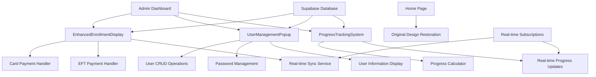
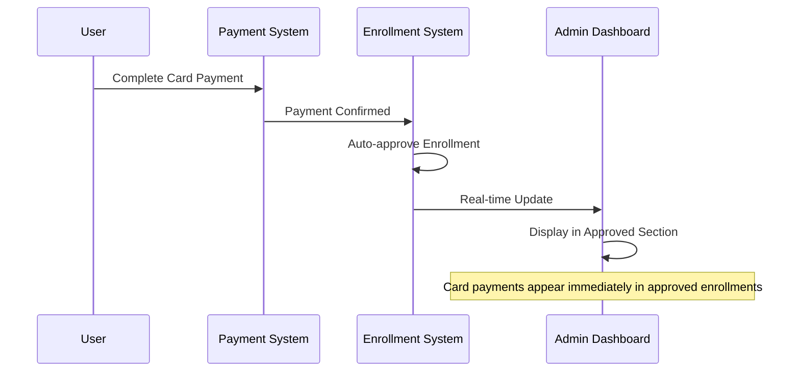
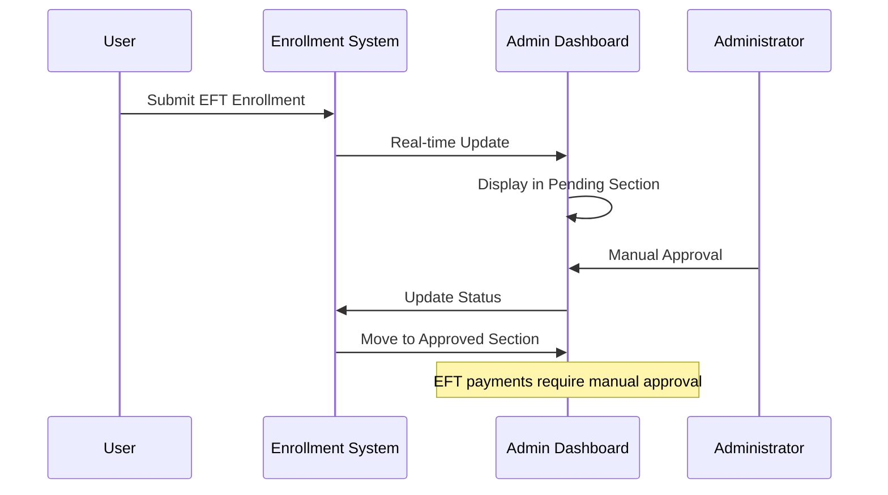

# Design Document

## Overview

The admin dashboard enhancement creates a comprehensive solution that properly displays enrollments in real-time, restores the original home page design, and implements advanced user management with detailed information popups and progress tracking. The system ensures card payment enrollments appear immediately in approved enrollments, EFT payments show in pending enrollments, and administrators can view and manage complete user information with full CRUD capabilities.

## Architecture

### Core Components

1. **EnhancedEnrollmentDisplay**: Real-time enrollment display system with payment type segregation
2. **UserManagementPopup**: Comprehensive user information modal with CRUD operations
3. **ProgressTrackingSystem**: Real-time progress monitoring for enrolled students
4. **OriginalHomePageRestoration**: Restoration of the original home page design
5. **AdminDashboardEnhancer**: Enhanced admin dashboard with improved enrollment management
6. **RealTimeEnrollmentSync**: Real-time synchronization for enrollment status changes

### System Architecture



## Components and Interfaces

### EnhancedEnrollmentDisplay Interface

```typescript
interface EnhancedEnrollmentDisplay {
  // Enrollment categorization
  categorizeEnrollments(enrollments: Enrollment[]): CategorizedEnrollments
  displayApprovedEnrollments(enrollments: Enrollment[]): React.ReactElement
  displayPendingEnrollments(enrollments: Enrollment[]): React.ReactElement
  
  // Real-time updates
  subscribeToEnrollmentChanges(): () => void
  handleCardPaymentApproval(enrollment: Enrollment): void
  handleEFTPaymentSubmission(enrollment: Enrollment): void
  
  // Payment type detection
  detectPaymentType(enrollment: Enrollment): 'CARD' | 'EFT'
  autoApproveCardPayments(enrollment: Enrollment): Promise<void>
}
```

### UserManagementPopup Interface

```typescript
interface UserManagementPopup {
  // User display
  displayUserDetails(user: User): React.ReactElement
  showUserPopup(userId: string): void
  closeUserPopup(): void
  
  // CRUD operations
  createUser(userData: CreateUserData): Promise<User>
  updateUser(userId: string, updates: UserUpdate): Promise<User>
  deleteUser(userId: string): Promise<void>
  
  // Password management
  generateSecurePassword(): string
  updateUserPassword(userId: string, newPassword: string): Promise<void>
  displayUserCredentials(user: User): React.ReactElement
  
  // User information management
  editUserInformation(userId: string, field: string, value: any): Promise<void>
  validateUserData(userData: Partial<User>): ValidationResult
}
```

### ProgressTrackingSystem Interface

```typescript
interface ProgressTrackingSystem {
  // Progress calculation
  calculateUserProgress(userId: string, courseId: string): Promise<number>
  getProgressPercentage(completedLessons: string[], totalLessons: number): number
  
  // Real-time progress updates
  subscribeToProgressUpdates(userId: string, courseId: string): () => void
  updateProgressDisplay(userId: string, courseId: string, progress: number): void
  
  // Progress monitoring
  monitorStudentProgress(enrollments: Enrollment[]): ProgressData[]
  displayProgressIndicator(progress: number): React.ReactElement
  
  // Progress persistence
  saveProgressToDatabase(userId: string, courseId: string, progress: number): Promise<void>
  syncProgressAcrossSessions(userId: string): Promise<void>
}
```

## Data Models

### Enhanced Enrollment Model

```typescript
interface EnhancedEnrollment {
  id: string
  user_id: string
  user_email: string
  course_id: string
  course_title: string
  status: 'pending' | 'approved' | 'rejected'
  payment_type: 'CARD' | 'EFT'
  payment_status: 'pending' | 'completed' | 'failed'
  
  // Enhanced fields
  auto_approved: boolean
  approval_reason: string
  progress_percentage: number
  real_time_progress: number
  
  // Timestamps
  enrolled_at: string
  approved_at?: string
  updated_at: string
  
  // User information
  user_details: {
    first_name: string
    last_name: string
    email: string
    contact_number: string
  }
  
  // Progress tracking
  progress_data: {
    completed_lessons: string[]
    total_lessons: number
    time_spent: number
    last_accessed: string
    quiz_scores: Record<string, number>
  }
}
```

### User Management Model

```typescript
interface UserManagementData {
  id: string
  email: string
  first_name: string
  last_name: string
  contact_number: string
  role: 'student' | 'instructor' | 'admin'
  
  // Enhanced user fields
  unique_password: string
  password_generated_at: string
  last_login: string
  account_status: 'active' | 'suspended' | 'pending'
  
  // Enrollment information
  total_enrollments: number
  active_enrollments: number
  completed_courses: number
  
  // Timestamps
  created_at: string
  updated_at: string
  last_modified_by: string
  
  // Additional information
  profile_picture?: string
  bio?: string
  preferences: UserPreferences
}
```

### Progress Tracking Model

```typescript
interface ProgressTrackingData {
  id: string
  user_id: string
  course_id: string
  enrollment_id: string
  
  // Progress metrics
  progress_percentage: number
  completed_lessons: string[]
  total_lessons: number
  current_lesson: string
  
  // Time tracking
  time_spent_minutes: number
  session_count: number
  last_accessed: string
  average_session_duration: number
  
  // Performance metrics
  quiz_scores: Record<string, number>
  assignment_scores: Record<string, number>
  overall_score: number
  
  // Real-time tracking
  is_currently_active: boolean
  last_activity: string
  current_session_start: string
  
  // Timestamps
  started_at: string
  updated_at: string
  completed_at?: string
}
```

## Enrollment Display Architecture

### Card Payment Auto-Approval Flow



### EFT Payment Pending Flow



## User Management Popup Architecture

### Popup Component Structure

```typescript
interface UserPopupComponents {
  // Main popup container
  UserDetailsModal: React.FC<{
    user: User
    onClose: () => void
    onUpdate: (updates: UserUpdate) => void
    onDelete: (userId: string) => void
  }>
  
  // Information display sections
  PersonalInfoSection: React.FC<{ user: User, editable: boolean }>
  ContactInfoSection: React.FC<{ user: User, editable: boolean }>
  AccountInfoSection: React.FC<{ user: User, editable: boolean }>
  PasswordSection: React.FC<{ user: User, onPasswordUpdate: (password: string) => void }>
  
  // Action buttons
  EditButton: React.FC<{ onEdit: () => void }>
  SaveButton: React.FC<{ onSave: () => void, loading: boolean }>
  DeleteButton: React.FC<{ onDelete: () => void, confirmRequired: boolean }>
  CancelButton: React.FC<{ onCancel: () => void }>
  
  // Form components
  EditableField: React.FC<{ 
    label: string
    value: string
    onUpdate: (value: string) => void
    type: 'text' | 'email' | 'tel' | 'password'
    validation?: (value: string) => boolean
  }>
}
```

### User CRUD Operations

```typescript
interface UserCRUDOperations {
  // Create operations
  createUser: {
    validateInput(userData: CreateUserData): ValidationResult
    generateCredentials(): UserCredentials
    saveToDatabase(userData: UserData): Promise<User>
    sendWelcomeEmail(user: User): Promise<void>
  }
  
  // Read operations
  fetchUserDetails(userId: string): Promise<UserDetails>
  getUserEnrollments(userId: string): Promise<Enrollment[]>
  getUserProgress(userId: string): Promise<ProgressData[]>
  
  // Update operations
  updatePersonalInfo(userId: string, info: PersonalInfo): Promise<void>
  updateContactInfo(userId: string, contact: ContactInfo): Promise<void>
  updatePassword(userId: string, password: string): Promise<void>
  updateRole(userId: string, role: UserRole): Promise<void>
  
  // Delete operations
  confirmDeletion(userId: string): Promise<boolean>
  softDeleteUser(userId: string): Promise<void>
  hardDeleteUser(userId: string): Promise<void>
  cleanupUserData(userId: string): Promise<void>
}
```

## Progress Tracking Implementation

### Real-time Progress Calculation

```typescript
interface ProgressCalculation {
  // Progress metrics
  calculateLessonProgress(completedLessons: string[], totalLessons: number): number
  calculateQuizProgress(quizScores: Record<string, number>): number
  calculateOverallProgress(lessonProgress: number, quizProgress: number): number
  
  // Real-time updates
  subscribeToLessonCompletion(userId: string, courseId: string): () => void
  updateProgressOnQuizCompletion(userId: string, courseId: string, score: number): void
  syncProgressAcrossDevices(userId: string): Promise<void>
  
  // Progress persistence
  saveProgressIncrement(userId: string, courseId: string, increment: number): Promise<void>
  batchUpdateProgress(progressUpdates: ProgressUpdate[]): Promise<void>
  
  // Progress display
  formatProgressPercentage(progress: number): string
  getProgressColor(progress: number): string
  generateProgressChart(progressHistory: ProgressHistory[]): ChartData
}
```

### Progress Display Components

```typescript
interface ProgressDisplayComponents {
  // Progress indicators
  ProgressBar: React.FC<{
    progress: number
    animated: boolean
    showPercentage: boolean
    color?: string
  }>
  
  CircularProgress: React.FC<{
    progress: number
    size: number
    strokeWidth: number
    color?: string
  }>
  
  ProgressBadge: React.FC<{
    progress: number
    variant: 'small' | 'medium' | 'large'
  }>
  
  // Detailed progress views
  ProgressDetails: React.FC<{
    userId: string
    courseId: string
    showTimeSpent: boolean
    showQuizScores: boolean
  }>
  
  ProgressHistory: React.FC<{
    progressData: ProgressHistory[]
    timeRange: 'week' | 'month' | 'all'
  }>
}
```

## Original Home Page Restoration

### Home Page Component Structure

```typescript
interface OriginalHomePageComponents {
  // Main sections
  HeroSection: React.FC<{
    title: string
    subtitle: string
    ctaButtons: CTAButton[]
  }>
  
  FeaturesSection: React.FC<{
    features: Feature[]
    layout: 'grid' | 'carousel'
  }>
  
  CTASection: React.FC<{
    title: string
    description: string
    primaryCTA: CTAButton
  }>
  
  Footer: React.FC<{
    links: FooterLink[]
    socialLinks: SocialLink[]
    copyright: string
  }>
  
  // Original styling
  originalStyling: {
    colors: ColorPalette
    typography: TypographyScale
    spacing: SpacingScale
    animations: AnimationConfig
  }
}
```

### Design Restoration Process

```typescript
interface DesignRestoration {
  // Component restoration
  restoreHeroSection(): React.ReactElement
  restoreFeaturesSection(): React.ReactElement
  restoreFooter(): React.ReactElement
  
  // Styling restoration
  applyOriginalColors(): void
  applyOriginalTypography(): void
  applyOriginalLayout(): void
  
  // Functionality restoration
  restoreNavigation(): void
  restoreAnimations(): void
  restoreResponsiveness(): void
  
  // Validation
  validateDesignConsistency(): boolean
  compareWithOriginal(): ComparisonResult
}
```

## Real-time Synchronization

### Real-time Event System

```typescript
interface RealTimeEventSystem {
  // Event types
  events: {
    'enrollment-created': EnrollmentEvent
    'enrollment-approved': ApprovalEvent
    'enrollment-rejected': RejectionEvent
    'progress-updated': ProgressEvent
    'user-updated': UserEvent
    'payment-completed': PaymentEvent
  }
  
  // Event handlers
  handleEnrollmentCreated(event: EnrollmentEvent): void
  handleEnrollmentApproved(event: ApprovalEvent): void
  handleProgressUpdated(event: ProgressEvent): void
  
  // Subscription management
  subscribe(eventType: string, handler: EventHandler): () => void
  unsubscribe(eventType: string, handler: EventHandler): void
  emit(eventType: string, data: any): void
  
  // Connection management
  connect(): Promise<void>
  disconnect(): void
  reconnect(): Promise<void>
  getConnectionStatus(): ConnectionStatus
}
```

## Error Handling and Resilience

### Error Handling Strategy

```typescript
interface ErrorHandlingStrategy {
  // Error types
  errorTypes: {
    NetworkError: 'network'
    DatabaseError: 'database'
    ValidationError: 'validation'
    AuthenticationError: 'auth'
    PermissionError: 'permission'
  }
  
  // Error handlers
  handleNetworkError(error: NetworkError): void
  handleDatabaseError(error: DatabaseError): void
  handleValidationError(error: ValidationError): void
  
  // Recovery mechanisms
  retryOperation(operation: () => Promise<any>, maxRetries: number): Promise<any>
  fallbackToCache(key: string): any
  showErrorMessage(error: Error): void
  
  // Resilience features
  offlineMode: boolean
  dataSync: boolean
  errorReporting: boolean
}
```

## Security Implementation

### Security Measures

```typescript
interface SecurityMeasures {
  // Authentication
  validateAdminAccess(): boolean
  checkUserPermissions(action: string): boolean
  
  // Data protection
  encryptSensitiveData(data: any): string
  decryptSensitiveData(encryptedData: string): any
  maskSensitiveInformation(data: any): any
  
  // Input validation
  validateUserInput(input: any, schema: ValidationSchema): ValidationResult
  sanitizeInput(input: string): string
  
  // Audit logging
  logAdminAction(action: string, userId: string, details: any): void
  logDataAccess(resource: string, userId: string): void
  
  // Password security
  generateSecurePassword(length: number): string
  hashPassword(password: string): string
  validatePasswordStrength(password: string): PasswordStrength
}
```

## Performance Optimization

### Performance Strategies

```typescript
interface PerformanceOptimization {
  // Data loading
  lazyLoadComponents(): void
  paginateResults(data: any[], pageSize: number): PaginatedData
  cacheFrequentlyAccessedData(key: string, data: any): void
  
  // Real-time optimization
  batchRealTimeUpdates(updates: Update[]): void
  throttleProgressUpdates(interval: number): void
  optimizeSubscriptions(): void
  
  // UI optimization
  virtualizeListComponents(): void
  memoizeExpensiveCalculations(): void
  optimizeReRenders(): void
  
  // Memory management
  cleanupUnusedData(): void
  limitCacheSize(maxSize: number): void
  garbageCollectOldData(): void
}
```

## Testing Strategy

### Component Testing

- **Enrollment Display**: Test card payment auto-approval and EFT pending display
- **User Management Popup**: Test CRUD operations and form validation
- **Progress Tracking**: Test real-time progress updates and calculations
- **Home Page Restoration**: Test design consistency and functionality

### Integration Testing

- **Real-time Synchronization**: Test enrollment status changes across sessions
- **Payment Type Detection**: Test automatic categorization of enrollments
- **User Management Flow**: Test complete user lifecycle management
- **Progress Tracking Flow**: Test progress updates from lesson completion to display

### Security Testing

- **Admin Access Control**: Test role-based access to admin functions
- **Data Protection**: Test sensitive data handling and encryption
- **Input Validation**: Test form inputs and data sanitization
- **Audit Logging**: Test action logging and data access tracking

## Deployment Considerations

### Environment Configuration

```typescript
interface EnvironmentConfig {
  database: {
    connectionString: string
    maxConnections: number
    queryTimeout: number
  }
  
  realTime: {
    websocketUrl: string
    reconnectInterval: number
    maxReconnectAttempts: number
  }
  
  security: {
    encryptionKey: string
    jwtSecret: string
    sessionTimeout: number
  }
  
  performance: {
    cacheEnabled: boolean
    cacheTTL: number
    maxCacheSize: number
  }
}
```

### Monitoring and Analytics

```typescript
interface MonitoringConfig {
  // Performance monitoring
  trackPageLoadTimes: boolean
  trackUserInteractions: boolean
  trackErrorRates: boolean
  
  // Business metrics
  trackEnrollmentApprovals: boolean
  trackUserManagementActions: boolean
  trackProgressUpdates: boolean
  
  // System health
  monitorDatabasePerformance: boolean
  monitorRealTimeConnections: boolean
  monitorCacheHitRates: boolean
  
  // Alerts
  performanceAlerts: boolean
  errorAlerts: boolean
  securityAlerts: boolean
}
```