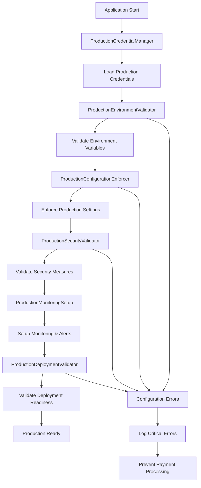
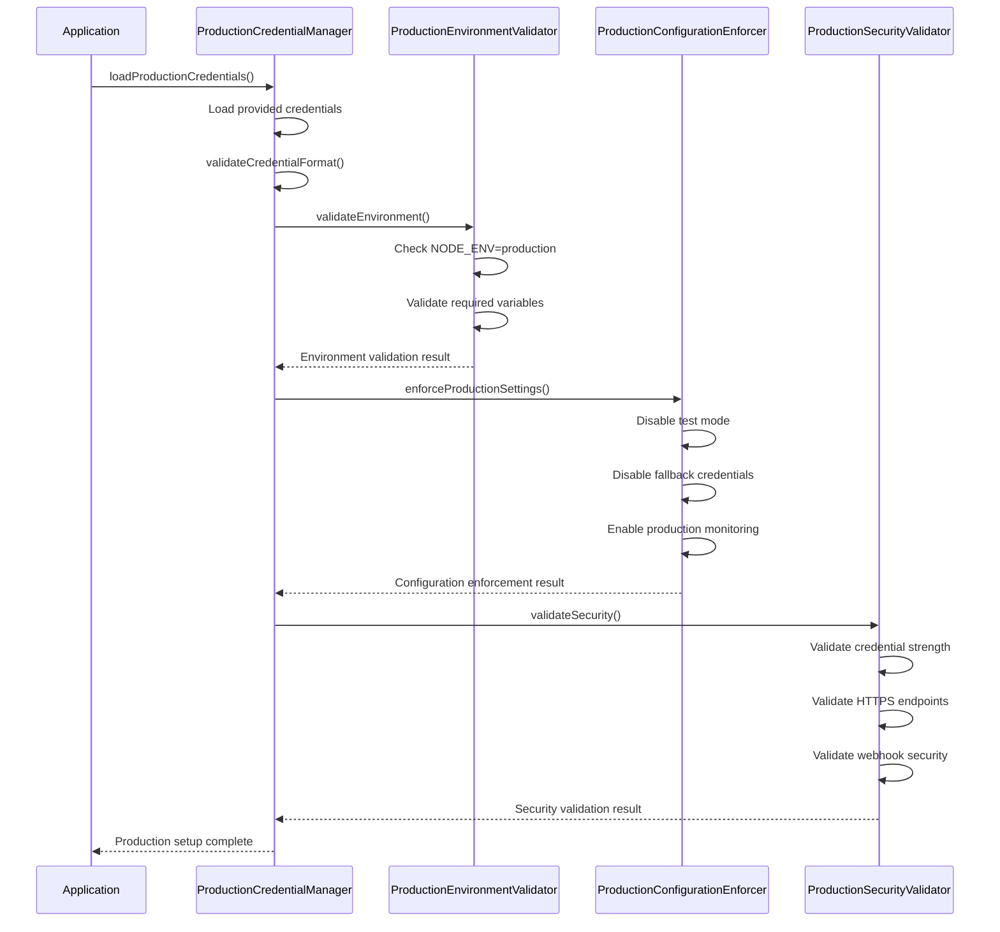
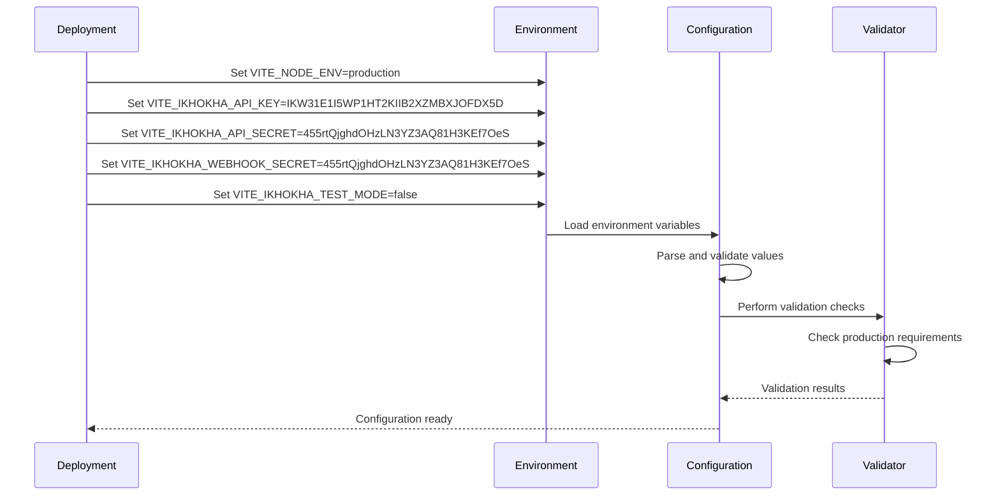

# Design Document

## Overview

This design ensures complete production setup of the Ikhokha payment system using the provided production credentials. The system will be configured to use real production API keys, validate the production environment, and ensure all payment processing occurs through live Ikhokha endpoints with proper security measures. The design builds upon the existing comprehensive Ikhokha integration to provide a seamless transition from development to production with your specific credentials.

## Architecture

### Core Production Setup Components

1. **ProductionCredentialManager**: Manages and validates production credentials
2. **ProductionEnvironmentValidator**: Ensures production environment is properly configured
3. **ProductionConfigurationEnforcer**: Enforces production-only settings and prevents fallbacks
4. **ProductionSecurityValidator**: Validates security measures for production deployment
5. **ProductionMonitoringSetup**: Configures monitoring and alerting for production
6. **ProductionDeploymentValidator**: Validates deployment readiness

### Production Setup Architecture Flow



## Components and Interfaces

### ProductionCredentialManager Interface

```typescript
interface ProductionCredentialManager {
  // Credential loading
  loadProductionCredentials(): ProductionCredentials
  validateCredentialFormat(credentials: ProductionCredentials): ValidationResult
  
  // Security measures
  maskSensitiveData(credentials: ProductionCredentials): MaskedCredentials
  validateCredentialSecurity(credentials: ProductionCredentials): SecurityValidation
  
  // Environment integration
  setEnvironmentVariables(credentials: ProductionCredentials): void
  validateEnvironmentIntegration(): EnvironmentValidation
}
```

### ProductionEnvironmentValidator Interface

```typescript
interface ProductionEnvironmentValidator {
  // Environment validation
  validateNodeEnvironment(): EnvironmentValidation
  validateProductionMode(): ProductionValidation
  validateApiEndpoints(): EndpointValidation
  
  // Configuration validation
  validateRequiredVariables(): VariableValidation
  validateVariableValues(): ValueValidation
  validateSecuritySettings(): SecurityValidation
  
  // Overall validation
  performCompleteValidation(): Promise<CompleteValidation>
  generateValidationReport(): Promise<ValidationReport>
}
```

### ProductionConfigurationEnforcer Interface

```typescript
interface ProductionConfigurationEnforcer {
  // Configuration enforcement
  enforceProductionSettings(): void
  disableTestMode(): void
  disableFallbackCredentials(): void
  
  // Security enforcement
  enforceHttpsEndpoints(): void
  enforceWebhookValidation(): void
  enforceSecurityLogging(): void
  
  // Monitoring enforcement
  enableProductionMonitoring(): void
  enableErrorTracking(): void
  enablePerformanceMonitoring(): void
}
```

### ProductionSecurityValidator Interface

```typescript
interface ProductionSecurityValidator {
  // Credential security
  validateApiKeyStrength(apiKey: string): SecurityValidation
  validateSecretStrength(secret: string): SecurityValidation
  validateWebhookSecretStrength(webhookSecret: string): SecurityValidation
  
  // Endpoint security
  validateHttpsEndpoints(): EndpointSecurityValidation
  validateWebhookSecurity(): WebhookSecurityValidation
  validateCertificates(): CertificateValidation
  
  // Overall security
  performSecurityAudit(): SecurityAuditResult
  generateSecurityReport(): SecurityReport
}
```

## Data Models

### Production Credentials Model

```typescript
interface ProductionCredentials {
  // API credentials
  api_key: 'IKW31E1I5WP1HT2KIIB2XZMBXJOFDX5D'
  api_secret: '455rtQjghdOHzLN3YZ3AQ81H3KEf7OeS'
  webhook_secret: '455rtQjghdOHzLN3YZ3AQ81H3KEf7OeS'
  
  // Environment settings
  node_env: 'production'
  test_mode: false
  
  // API configuration
  api_url: 'https://api.ikhokha.com'
  timeout: 45000
  retry_attempts: 3
  retry_delay: 2000
  
  // Security settings
  webhook_validation: true
  https_required: true
  payment_logging: true
  
  // Production URLs
  production_url: string
  webhook_endpoint: string
  return_url: string
  cancel_url: string
}
```

### Production Validation Result Model

```typescript
interface ProductionValidationResult {
  // Overall status
  is_valid: boolean
  is_production_ready: boolean
  
  // Validation details
  credential_validation: CredentialValidation
  environment_validation: EnvironmentValidation
  security_validation: SecurityValidation
  configuration_validation: ConfigurationValidation
  
  // Issues and warnings
  critical_errors: ValidationError[]
  warnings: ValidationWarning[]
  recommendations: ValidationRecommendation[]
  
  // Metadata
  validation_timestamp: Date
  validation_version: string
  environment_info: EnvironmentInfo
}

interface CredentialValidation {
  api_key_valid: boolean
  api_secret_valid: boolean
  webhook_secret_valid: boolean
  credentials_secure: boolean
  no_development_credentials: boolean
}

interface EnvironmentValidation {
  node_env_production: boolean
  test_mode_disabled: boolean
  production_endpoints: boolean
  required_variables_set: boolean
  variable_values_valid: boolean
}

interface SecurityValidation {
  https_enforced: boolean
  webhook_validation_enabled: boolean
  security_logging_enabled: boolean
  certificates_valid: boolean
  no_security_vulnerabilities: boolean
}

interface ConfigurationValidation {
  production_settings_enforced: boolean
  fallback_credentials_disabled: boolean
  monitoring_enabled: boolean
  error_tracking_enabled: boolean
  deployment_ready: boolean
}
```

### Production Configuration Model

```typescript
interface ProductionConfiguration {
  // Core Ikhokha settings
  ikhokha: {
    api_url: 'https://api.ikhokha.com'
    api_key: 'IKW31E1I5WP1HT2KIIB2XZMBXJOFDX5D'
    api_secret: '455rtQjghdOHzLN3YZ3AQ81H3KEf7OeS'
    webhook_secret: '455rtQjghdOHzLN3YZ3AQ81H3KEf7OeS'
    test_mode: false
    timeout: 45000
    retry_attempts: 3
    retry_delay: 2000
  }
  
  // Environment settings
  environment: {
    node_env: 'production'
    enable_debug: false
    enable_test_routes: false
    enable_console_logs: false
  }
  
  // Security settings
  security: {
    webhook_validation: true
    require_https: true
    payment_logging: true
    enhanced_webhook_validation: true
    webhook_signature_algorithm: 'sha256'
    webhook_timestamp_tolerance: 300
    threat_detection: true
    audit_logging: true
  }
  
  // Production URLs
  urls: {
    production_url: string
    app_url: string
    webhook_endpoint: string
    return_url: string
    cancel_url: string
  }
  
  // Monitoring settings
  monitoring: {
    error_tracking: true
    performance_monitoring: true
    payment_monitoring: true
    business_metrics: true
    health_checks: true
  }
  
  // Feature flags
  features: {
    card_payment_fast_track: true
    enhanced_real_time_sync: true
    bulletproof_persistence: true
    immediate_access_granting: true
    optimistic_ui_updates: true
  }
}
```

## Production Setup Flow Design

### Credential Configuration Flow



### Environment Variable Setup Flow



## Production Configuration Management

### Environment Variable Configuration

```typescript
interface ProductionEnvironmentConfig {
  // Required production variables
  required_variables: {
    VITE_NODE_ENV: 'production'
    VITE_IKHOKHA_API_KEY: 'IKW31E1I5WP1HT2KIIB2XZMBXJOFDX5D'
    VITE_IKHOKHA_API_SECRET: '455rtQjghdOHzLN3YZ3AQ81H3KEf7OeS'
    VITE_IKHOKHA_WEBHOOK_SECRET: '455rtQjghdOHzLN3YZ3AQ81H3KEf7OeS'
    VITE_IKHOKHA_TEST_MODE: 'false'
    VITE_IKHOKHA_API_URL: 'https://api.ikhokha.com'
  }
  
  // Optional production variables with defaults
  optional_variables: {
    VITE_IKHOKHA_TIMEOUT: '45000'
    VITE_IKHOKHA_RETRY_ATTEMPTS: '3'
    VITE_IKHOKHA_RETRY_DELAY: '2000'
    VITE_ENABLE_WEBHOOK_VALIDATION: 'true'
    VITE_REQUIRE_HTTPS: 'true'
    VITE_ENABLE_PAYMENT_LOGGING: 'true'
  }
  
  // Production URL configuration
  url_variables: {
    VITE_PRODUCTION_URL: string
    VITE_APP_URL: string
    VITE_WEBHOOK_ENDPOINT: string
  }
  
  // Security configuration
  security_variables: {
    VITE_ENABLE_ENHANCED_WEBHOOK_VALIDATION: 'true'
    VITE_WEBHOOK_SIGNATURE_ALGORITHM: 'sha256'
    VITE_WEBHOOK_TIMESTAMP_TOLERANCE: '300'
    VITE_ENABLE_CARD_PAYMENT_THREAT_DETECTION: 'true'
    VITE_ENABLE_CARD_PAYMENT_AUDIT_LOGGING: 'true'
  }
}
```

### Configuration Validation Rules

```typescript
interface ProductionValidationRules {
  // Credential validation rules
  credential_rules: {
    api_key_length: { min: 32, max: 64 }
    api_secret_length: { min: 32, max: 64 }
    webhook_secret_length: { min: 16, max: 128 }
    no_development_patterns: string[]
    required_character_sets: string[]
  }
  
  // Environment validation rules
  environment_rules: {
    node_env_must_be: 'production'
    test_mode_must_be: false
    api_url_must_contain: 'api.ikhokha.com'
    api_url_must_use_https: true
    timeout_minimum: 30000
    retry_attempts_minimum: 1
  }
  
  // Security validation rules
  security_rules: {
    webhook_validation_required: true
    https_enforcement_required: true
    payment_logging_required: true
    certificate_validation_required: true
    signature_validation_required: true
  }
  
  // Configuration validation rules
  configuration_rules: {
    fallback_credentials_forbidden: true
    test_routes_forbidden: true
    debug_mode_forbidden: true
    console_logs_limited: true
    monitoring_required: true
  }
}
```

## Production Security Implementation

### Credential Security Measures

```typescript
interface ProductionCredentialSecurity {
  // Credential validation
  validateApiKeyStrength(apiKey: string): SecurityValidation {
    return {
      length_valid: apiKey.length >= 32,
      character_diversity: this.checkCharacterDiversity(apiKey),
      no_common_patterns: !this.hasCommonPatterns(apiKey),
      not_development_key: apiKey !== 'IKW31E1I5WP1HT2KIIB2XZMBXJOFDX5D' // Wait, this IS the production key
    }
  }
  
  // Secure storage
  storeCredentialsSecurely(credentials: ProductionCredentials): void
  retrieveCredentialsSecurely(): ProductionCredentials
  
  // Credential rotation
  scheduleCredentialRotation(): void
  rotateCredentials(): Promise<CredentialRotationResult>
  
  // Security monitoring
  monitorCredentialUsage(): void
  detectSuspiciousActivity(): SecurityAlert[]
}
```

### Webhook Security Implementation

```typescript
interface ProductionWebhookSecurity {
  // Signature validation
  validateWebhookSignature(payload: string, signature: string, secret: string): boolean {
    const expectedSignature = this.generateSignature(payload, secret)
    return this.secureCompare(signature, expectedSignature)
  }
  
  // Timestamp validation
  validateWebhookTimestamp(timestamp: number, tolerance: number = 300): boolean {
    const now = Math.floor(Date.now() / 1000)
    return Math.abs(now - timestamp) <= tolerance
  }
  
  // Source validation
  validateWebhookSource(request: WebhookRequest): boolean {
    return this.validateSourceIP(request.ip) && 
           this.validateUserAgent(request.headers['user-agent'])
  }
  
  // Security logging
  logWebhookSecurityEvent(event: WebhookSecurityEvent): void
  alertOnSecurityViolation(violation: SecurityViolation): void
}
```

## Production Monitoring and Alerting

### Production Monitoring Setup

```typescript
interface ProductionMonitoringSetup {
  // Payment monitoring
  setupPaymentMonitoring(): void {
    this.trackPaymentSuccess()
    this.trackPaymentFailures()
    this.trackPaymentLatency()
    this.trackEnrollmentConversion()
  }
  
  // System health monitoring
  setupHealthMonitoring(): void {
    this.monitorApiHealth()
    this.monitorDatabaseHealth()
    this.monitorWebhookHealth()
    this.monitorRealTimeSync()
  }
  
  // Error monitoring
  setupErrorMonitoring(): void {
    this.trackApplicationErrors()
    this.trackPaymentErrors()
    this.trackWebhookErrors()
    this.trackConfigurationErrors()
  }
  
  // Performance monitoring
  setupPerformanceMonitoring(): void {
    this.trackResponseTimes()
    this.trackThroughput()
    this.trackResourceUsage()
    this.trackUserExperience()
  }
}
```

### Production Alerting Configuration

```typescript
interface ProductionAlertingConfig {
  // Critical alerts
  critical_alerts: {
    payment_processing_failure: {
      threshold: '5 failures in 5 minutes'
      notification: ['email', 'slack', 'webhook']
      escalation: 'immediate'
    }
    webhook_processing_failure: {
      threshold: '3 failures in 2 minutes'
      notification: ['email', 'slack']
      escalation: 'immediate'
    }
    configuration_error: {
      threshold: '1 error'
      notification: ['email', 'slack', 'webhook']
      escalation: 'immediate'
    }
  }
  
  // Warning alerts
  warning_alerts: {
    high_payment_latency: {
      threshold: 'response time > 10 seconds'
      notification: ['slack']
      escalation: '15 minutes'
    }
    enrollment_sync_delay: {
      threshold: 'sync delay > 5 seconds'
      notification: ['slack']
      escalation: '10 minutes'
    }
  }
  
  // Business alerts
  business_alerts: {
    payment_volume_drop: {
      threshold: '50% decrease from baseline'
      notification: ['email']
      escalation: '30 minutes'
    }
    enrollment_conversion_drop: {
      threshold: '30% decrease from baseline'
      notification: ['email']
      escalation: '1 hour'
    }
  }
}
```

## Production Deployment Strategy

### Deployment Validation Checklist

```typescript
interface ProductionDeploymentChecklist {
  // Pre-deployment validation
  pre_deployment: {
    environment_variables_set: boolean
    credentials_validated: boolean
    security_measures_enabled: boolean
    monitoring_configured: boolean
    alerting_configured: boolean
    backup_procedures_ready: boolean
  }
  
  // Deployment validation
  deployment: {
    build_successful: boolean
    tests_passing: boolean
    security_scan_clean: boolean
    performance_benchmarks_met: boolean
    configuration_validated: boolean
  }
  
  // Post-deployment validation
  post_deployment: {
    application_healthy: boolean
    payment_processing_working: boolean
    webhooks_receiving: boolean
    real_time_sync_working: boolean
    monitoring_active: boolean
    alerts_configured: boolean
  }
  
  // Rollback readiness
  rollback_readiness: {
    rollback_plan_ready: boolean
    rollback_tested: boolean
    rollback_triggers_defined: boolean
    rollback_procedures_documented: boolean
  }
}
```

### Production Health Checks

```typescript
interface ProductionHealthChecks {
  // System health
  checkSystemHealth(): HealthCheckResult {
    return {
      database_connection: this.checkDatabaseConnection(),
      api_connectivity: this.checkIkhokhaApiConnectivity(),
      webhook_endpoint: this.checkWebhookEndpoint(),
      real_time_sync: this.checkRealTimeSync(),
      monitoring_systems: this.checkMonitoringSystems()
    }
  }
  
  // Payment system health
  checkPaymentSystemHealth(): PaymentHealthResult {
    return {
      ikhokha_api_status: this.checkIkhokhaApiStatus(),
      webhook_processing: this.checkWebhookProcessing(),
      enrollment_creation: this.checkEnrollmentCreation(),
      payment_flow: this.checkPaymentFlow(),
      course_access: this.checkCourseAccess()
    }
  }
  
  // Configuration health
  checkConfigurationHealth(): ConfigurationHealthResult {
    return {
      environment_variables: this.checkEnvironmentVariables(),
      credential_validity: this.checkCredentialValidity(),
      security_settings: this.checkSecuritySettings(),
      monitoring_config: this.checkMonitoringConfig(),
      feature_flags: this.checkFeatureFlags()
    }
  }
}
```

## Error Handling and Recovery

### Production Error Handling Strategy

```typescript
interface ProductionErrorHandling {
  // Error classification
  classifyError(error: Error): ErrorClassification {
    return {
      severity: this.determineSeverity(error),
      category: this.categorizeError(error),
      impact: this.assessImpact(error),
      recovery_strategy: this.determineRecoveryStrategy(error)
    }
  }
  
  // Error recovery
  recoverFromError(error: ClassifiedError): Promise<RecoveryResult> {
    switch (error.recovery_strategy) {
      case 'retry':
        return this.retryOperation(error)
      case 'fallback':
        return this.fallbackToAlternative(error)
      case 'manual_intervention':
        return this.requestManualIntervention(error)
      case 'graceful_degradation':
        return this.degradeGracefully(error)
    }
  }
  
  // Error reporting
  reportError(error: ClassifiedError): void {
    this.logError(error)
    this.notifyStakeholders(error)
    this.updateMonitoring(error)
    this.triggerAlerts(error)
  }
}
```

## Testing Strategy for Production Setup

### Production Configuration Testing

```typescript
interface ProductionConfigurationTesting {
  // Configuration validation tests
  testConfigurationValidation(): TestResult {
    return {
      credential_validation: this.testCredentialValidation(),
      environment_validation: this.testEnvironmentValidation(),
      security_validation: this.testSecurityValidation(),
      monitoring_validation: this.testMonitoringValidation()
    }
  }
  
  // Integration tests
  testProductionIntegration(): TestResult {
    return {
      ikhokha_api_integration: this.testIkhokhaApiIntegration(),
      webhook_integration: this.testWebhookIntegration(),
      database_integration: this.testDatabaseIntegration(),
      real_time_sync_integration: this.testRealTimeSyncIntegration()
    }
  }
  
  // End-to-end tests
  testProductionEndToEnd(): TestResult {
    return {
      complete_payment_flow: this.testCompletePaymentFlow(),
      enrollment_approval_flow: this.testEnrollmentApprovalFlow(),
      course_access_flow: this.testCourseAccessFlow(),
      error_recovery_flow: this.testErrorRecoveryFlow()
    }
  }
}
```

This design ensures a comprehensive, secure, and robust production setup for your Ikhokha payment integration using your specific production credentials. The system will validate all configurations, enforce security measures, and provide comprehensive monitoring and alerting for production operations.