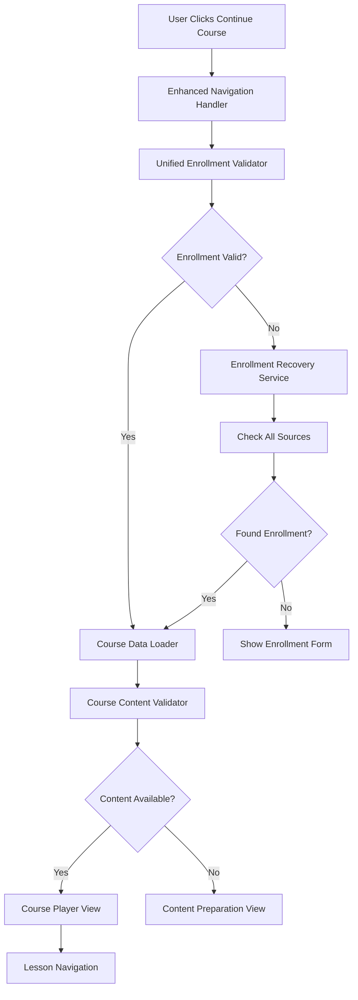

# Course Navigation Fix Design Document

## Overview

This design addresses the critical course navigation failure where enrolled users cannot access their course lessons when clicking "Continue Course" or "Start Learning" buttons. The solution focuses on robust enrollment detection, reliable course data loading, and bulletproof navigation flow.

## Architecture

### Current Issues Identified

1. **Enrollment Detection Fragmentation**: Multiple enrollment status sources (localStorage, hooks, API) are not properly synchronized
2. **Course Data Loading Failures**: Dynamic course loading fails silently, causing "Course Not Found" errors
3. **Navigation Flow Interruption**: Users get redirected to error pages instead of course content
4. **Inconsistent State Management**: Course access state is not reliably maintained across components

### Proposed Solution Architecture



## Components and Interfaces

### 1. Enhanced Navigation Handler

**Purpose**: Centralized navigation logic for course access

```typescript
interface EnhancedNavigationHandler {
  navigateToCourse(courseId: string): Promise<NavigationResult>;
  validateAccess(courseId: string, userId: string): Promise<AccessValidation>;
  handleNavigationError(error: NavigationError): void;
}

interface NavigationResult {
  success: boolean;
  destination: string;
  error?: NavigationError;
  fallbackAction?: string;
}

interface AccessValidation {
  hasAccess: boolean;
  enrollmentStatus: EnrollmentStatus;
  accessLevel: 'full' | 'preview' | 'none';
  dataSource: string;
}
```

### 2. Unified Enrollment Validator

**Purpose**: Single source of truth for enrollment status

```typescript
interface UnifiedEnrollmentValidator {
  validateEnrollment(courseId: string, userId: string): Promise<EnrollmentValidation>;
  checkAllSources(courseId: string, userId: string): Promise<EnrollmentSource[]>;
  reconcileEnrollmentData(sources: EnrollmentSource[]): EnrollmentStatus;
}

interface EnrollmentValidation {
  isEnrolled: boolean;
  status: 'enrolled' | 'pending' | 'rejected' | 'unenrolled';
  confidence: 'high' | 'medium' | 'low';
  sources: EnrollmentSource[];
  lastVerified: Date;
}

interface EnrollmentSource {
  type: 'localStorage' | 'api' | 'context' | 'persistence';
  data: any;
  timestamp: Date;
  reliability: number;
}
```

### 3. Course Data Loader

**Purpose**: Reliable course content loading with fallbacks

```typescript
interface CourseDataLoader {
  loadCourse(courseId: string): Promise<CourseLoadResult>;
  validateCourseData(course: Course): CourseValidation;
  createFallbackCourse(courseId: string): Course;
}

interface CourseLoadResult {
  course: Course | null;
  status: 'success' | 'partial' | 'fallback' | 'failed';
  modules: Module[];
  lessons: Lesson[];
  errors: string[];
}

interface CourseValidation {
  isValid: boolean;
  hasModules: boolean;
  hasLessons: boolean;
  missingData: string[];
  canProceed: boolean;
}
```

### 4. Course Access Guard

**Purpose**: Protect course routes and ensure proper access

```typescript
interface CourseAccessGuard {
  canAccess(courseId: string, user: User): Promise<AccessDecision>;
  enforceAccess(courseId: string, user: User): Promise<void>;
  handleAccessDenied(reason: string): void;
}

interface AccessDecision {
  allowed: boolean;
  reason: string;
  redirectTo?: string;
  requiresAction?: string;
}
```

## Data Models

### Enhanced Course Model

```typescript
interface EnhancedCourse extends Course {
  // Core course data
  id: string;
  title: string;
  description: string;
  
  // Content structure
  modules: Module[];
  lessons: Lesson[];
  
  // Access control
  accessLevel: 'public' | 'enrolled' | 'premium';
  enrollmentRequired: boolean;
  
  // Content validation
  contentStatus: 'complete' | 'partial' | 'placeholder';
  lastUpdated: Date;
  
  // Navigation metadata
  defaultLesson?: string;
  navigationStructure: NavigationNode[];
}

interface NavigationNode {
  id: string;
  type: 'module' | 'lesson' | 'quiz';
  title: string;
  order: number;
  children?: NavigationNode[];
  accessible: boolean;
}
```

### Enrollment State Model

```typescript
interface EnrollmentState {
  courseId: string;
  userId: string;
  status: EnrollmentStatus;
  
  // Verification data
  verifiedAt: Date;
  verificationSource: string;
  confidence: number;
  
  // Access permissions
  accessLevel: AccessLevel;
  permissions: Permission[];
  
  // Progress tracking
  progress: number;
  completedLessons: string[];
  currentLesson?: string;
}

type EnrollmentStatus = 'enrolled' | 'pending' | 'rejected' | 'unenrolled';
type AccessLevel = 'full' | 'preview' | 'none';
type Permission = 'view_content' | 'submit_assignments' | 'access_resources';
```

## Error Handling

### Navigation Error Types

```typescript
enum NavigationErrorType {
  COURSE_NOT_FOUND = 'course_not_found',
  ACCESS_DENIED = 'access_denied',
  ENROLLMENT_INVALID = 'enrollment_invalid',
  CONTENT_UNAVAILABLE = 'content_unavailable',
  LOADING_FAILED = 'loading_failed',
  NETWORK_ERROR = 'network_error'
}

interface NavigationError {
  type: NavigationErrorType;
  message: string;
  courseId: string;
  userId?: string;
  details: any;
  recoverable: boolean;
  suggestedAction: string;
}
```

### Error Recovery Strategies

1. **Course Not Found**: Check alternative course IDs, suggest similar courses
2. **Access Denied**: Verify enrollment status, offer enrollment options
3. **Content Unavailable**: Show preparation message, estimate availability
4. **Loading Failed**: Retry with exponential backoff, use cached data
5. **Network Error**: Offline mode, retry when connection restored

## Testing Strategy

### Unit Tests

1. **Enrollment Validation Tests**
   - Test all enrollment source combinations
   - Verify confidence scoring algorithm
   - Test edge cases (expired enrollments, conflicting data)

2. **Course Loading Tests**
   - Test dynamic course loading for all course types
   - Verify fallback course creation
   - Test course data validation logic

3. **Navigation Handler Tests**
   - Test successful navigation flows
   - Test error handling and recovery
   - Test access control enforcement

### Integration Tests

1. **End-to-End Navigation Flow**
   - User clicks "Continue Course" → reaches course content
   - Test across different enrollment states
   - Test with various course data conditions

2. **Cross-Component Communication**
   - Test enrollment status synchronization
   - Test course data sharing between components
   - Test error propagation and handling

3. **Performance Tests**
   - Measure navigation time from click to content
   - Test with large course datasets
   - Test concurrent user scenarios

## Implementation Plan

### Phase 1: Core Infrastructure
- Implement UnifiedEnrollmentValidator
- Create EnhancedNavigationHandler
- Set up error handling framework

### Phase 2: Course Data Management
- Enhance CourseDataLoader with fallbacks
- Implement course content validation
- Create course access guard system

### Phase 3: Navigation Flow
- Update course navigation components
- Implement error recovery mechanisms
- Add comprehensive logging

### Phase 4: Testing & Optimization
- Comprehensive test suite
- Performance optimization
- User experience refinements

## Security Considerations

1. **Access Control**: Verify enrollment status server-side when possible
2. **Data Validation**: Sanitize all course data before rendering
3. **Error Information**: Avoid exposing sensitive system details in error messages
4. **Audit Logging**: Log all course access attempts for security monitoring

## Performance Considerations

1. **Lazy Loading**: Load course content progressively
2. **Caching**: Cache course data and enrollment status
3. **Preloading**: Preload likely-to-be-accessed courses
4. **Error Recovery**: Implement fast fallback mechanisms

## Monitoring and Analytics

1. **Navigation Success Rate**: Track successful course access attempts
2. **Error Frequency**: Monitor and alert on navigation failures
3. **Performance Metrics**: Track navigation timing and bottlenecks
4. **User Experience**: Monitor user drop-off points in navigation flow