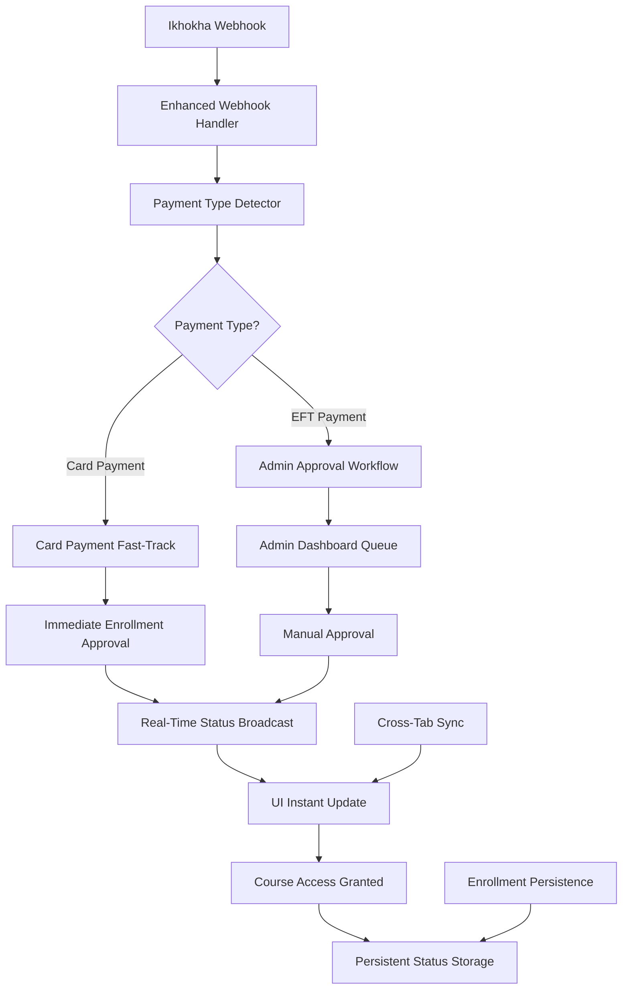
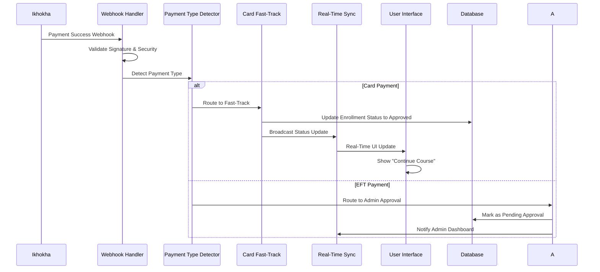

# Design Document

## Overview

This design addresses the critical issue where Ikhokha card payments are not providing immediate course access to users. The system currently has comprehensive webhook handling and payment processing infrastructure, but there's a gap in the immediate approval flow for card payments. This design creates a bulletproof card payment approval system that ensures users get instant access to course content after successful card payments, while maintaining the existing EFT approval workflow.

The solution focuses on enhancing the existing webhook processing pipeline to detect card payments and trigger immediate enrollment approval, coupled with real-time UI updates and persistent enrollment status management.

## Architecture

### Core System Enhancement Strategy

The design builds upon the existing production Ikhokha integration by adding a **Card Payment Fast-Track System** that intercepts successful card payment webhooks and immediately approves enrollments without admin intervention.



### Enhanced Webhook Processing Flow



## Components and Interfaces

### Enhanced Payment Type Detection System

```typescript
interface PaymentTypeDetector {
  // Core detection methods
  detectPaymentType(webhookData: IkhokhaWebhook): PaymentTypeResult
  isCardPayment(webhookData: IkhokhaWebhook): boolean
  isEFTPayment(webhookData: IkhokhaWebhook): boolean
  
  // Enhanced detection with metadata
  analyzePaymentMethod(
    webhookData: IkhokhaWebhook,
    enrollmentData: EnrollmentData
  ): PaymentAnalysisResult
  
  // Confidence scoring
  getPaymentTypeConfidence(detection: PaymentTypeResult): number
}

interface PaymentTypeResult {
  type: 'card' | 'eft' | 'unknown'
  confidence: number
  indicators: PaymentTypeIndicator[]
  metadata: PaymentTypeMetadata
}

interface PaymentTypeIndicator {
  field: string
  value: any
  weight: number
  description: string
}

interface PaymentTypeMetadata {
  cardType?: string
  maskedCardNumber?: string
  authCode?: string
  processingTime?: number
  responseCode: string
}
```

### Card Payment Fast-Track Service

```typescript
interface CardPaymentFastTrack {
  // Main processing method
  processCardPayment(
    webhookData: IkhokhaWebhook,
    enrollment: EnrollmentData
  ): Promise<FastTrackResult>
  
  // Immediate approval workflow
  approveEnrollmentImmediately(
    enrollmentId: string,
    paymentData: PaymentData
  ): Promise<ApprovalResult>
  
  // Access granting
  grantCourseAccessImmediately(
    enrollmentId: string,
    userId: string,
    courseId: string
  ): Promise<AccessResult>
  
  // Audit and logging
  logFastTrackApproval(
    enrollmentId: string,
    paymentData: PaymentData,
    result: FastTrackResult
  ): Promise<void>
}

interface FastTrackResult {
  success: boolean
  enrollmentApproved: boolean
  accessGranted: boolean
  processingTimeMs: number
  error?: FastTrackError
  auditTrail: AuditEntry[]
}

interface ApprovalResult {
  approved: boolean
  approvalTimestamp: Date
  approvedBy: 'system_card_payment'
  enrollmentId: string
  previousStatus: EnrollmentStatus
  newStatus: EnrollmentStatus
}

interface AccessResult {
  accessGranted: boolean
  grantedAt: Date
  courseId: string
  userId: string
  accessLevel: 'full' | 'limited' | 'none'
  expiresAt?: Date
}
```

### Enhanced Real-Time Status Broadcasting

```typescript
interface EnhancedRealTimeSync {
  // Immediate status broadcasting
  broadcastImmediateApproval(update: ImmediateApprovalUpdate): Promise<void>
  broadcastCourseAccessGranted(update: CourseAccessUpdate): Promise<void>
  
  // Cross-tab synchronization
  syncEnrollmentStatusAcrossTabs(
    userId: string,
    courseId: string,
    status: EnrollmentStatus
  ): Promise<void>
  
  // UI update coordination
  triggerUIRefresh(
    userId: string,
    courseId: string,
    updateType: UIUpdateType
  ): Promise<void>
  
  // Persistence coordination
  coordinatePersistenceUpdate(
    enrollmentData: EnrollmentData,
    updateSource: UpdateSource
  ): Promise<void>
}

interface ImmediateApprovalUpdate {
  enrollmentId: string
  userId: string
  courseId: string
  approvalType: 'card_payment_automatic'
  timestamp: Date
  paymentReference: string
  accessGranted: boolean
}

interface CourseAccessUpdate {
  userId: string
  courseId: string
  accessLevel: 'granted' | 'revoked'
  grantedAt: Date
  source: 'card_payment' | 'admin_approval' | 'manual'
}

enum UIUpdateType {
  ENROLLMENT_APPROVED = 'enrollment_approved',
  ACCESS_GRANTED = 'access_granted',
  BUTTON_STATE_CHANGE = 'button_state_change',
  PROGRESS_UPDATE = 'progress_update'
}

enum UpdateSource {
  WEBHOOK_CARD_PAYMENT = 'webhook_card_payment',
  WEBHOOK_EFT_PAYMENT = 'webhook_eft_payment',
  ADMIN_APPROVAL = 'admin_approval',
  SYSTEM_AUTOMATIC = 'system_automatic'
}
```

### Bulletproof Enrollment Persistence

```typescript
interface BulletproofEnrollmentPersistence {
  // Immediate persistence with multiple backups
  persistEnrollmentStatusImmediately(
    enrollmentData: EnrollmentData,
    source: UpdateSource
  ): Promise<PersistenceResult>
  
  // Multi-layer storage strategy
  storeWithMultipleBackups(
    key: string,
    data: any,
    strategies: StorageStrategy[]
  ): Promise<void>
  
  // Conflict resolution
  resolveEnrollmentConflicts(
    localData: EnrollmentData,
    remoteData: EnrollmentData
  ): EnrollmentData
  
  // Recovery mechanisms
  recoverEnrollmentStatus(
    userId: string,
    courseId: string
  ): Promise<EnrollmentRecoveryResult>
}

interface PersistenceResult {
  success: boolean
  strategiesUsed: StorageStrategy[]
  backupsCreated: number
  conflictsResolved: number
  error?: PersistenceError
}

enum StorageStrategy {
  LOCAL_STORAGE_PRIMARY = 'localStorage_primary',
  LOCAL_STORAGE_BACKUP = 'localStorage_backup',
  SESSION_STORAGE = 'sessionStorage',
  INDEXED_DB = 'indexedDB',
  MEMORY_CACHE = 'memoryCache',
  BROADCAST_CHANNEL = 'broadcastChannel'
}

interface EnrollmentRecoveryResult {
  recovered: boolean
  source: StorageStrategy
  data?: EnrollmentData
  confidence: number
  alternativeSources: StorageStrategy[]
}
```

## Data Models

### Enhanced Enrollment Status Model

```typescript
interface EnhancedEnrollmentData {
  // Core enrollment data
  id: string
  user_id: string
  user_email: string
  course_id: string
  course_title: string
  status: EnrollmentStatus
  
  // Payment tracking
  payment_type: PaymentType
  payment_status: PaymentStatus
  payment_reference: string
  ikhokha_transaction_id?: string
  
  // Approval workflow
  approval_type: ApprovalType
  approved_by: string
  approved_at?: Date
  approval_source: ApprovalSource
  
  // Access control
  course_access_granted: boolean
  access_granted_at?: Date
  access_level: AccessLevel
  
  // Audit trail
  status_history: StatusHistoryEntry[]
  last_updated_by: UpdateSource
  
  // Timestamps
  created_at: Date
  updated_at: Date
  
  // Real-time sync
  sync_version: number
  last_synced_at: Date
}

enum ApprovalType {
  AUTOMATIC_CARD_PAYMENT = 'automatic_card_payment',
  MANUAL_ADMIN_APPROVAL = 'manual_admin_approval',
  SYSTEM_OVERRIDE = 'system_override',
  BULK_APPROVAL = 'bulk_approval'
}

enum ApprovalSource {
  WEBHOOK_CARD_PAYMENT = 'webhook_card_payment',
  ADMIN_DASHBOARD = 'admin_dashboard',
  API_CALL = 'api_call',
  SYSTEM_MIGRATION = 'system_migration'
}

enum AccessLevel {
  FULL = 'full',
  LIMITED = 'limited',
  PREVIEW = 'preview',
  NONE = 'none'
}

interface StatusHistoryEntry {
  timestamp: Date
  previous_status: EnrollmentStatus
  new_status: EnrollmentStatus
  changed_by: string
  change_source: UpdateSource
  reason?: string
  metadata?: Record<string, any>
}
```

### Payment Type Detection Model

```typescript
interface PaymentDetectionRules {
  // Card payment indicators
  cardPaymentIndicators: PaymentIndicatorRule[]
  
  // EFT payment indicators
  eftPaymentIndicators: PaymentIndicatorRule[]
  
  // Fallback rules
  fallbackRules: FallbackRule[]
  
  // Confidence thresholds
  confidenceThresholds: ConfidenceThresholds
}

interface PaymentIndicatorRule {
  field: string
  condition: ConditionType
  value: any
  weight: number
  description: string
  required: boolean
}

enum ConditionType {
  EQUALS = 'equals',
  CONTAINS = 'contains',
  STARTS_WITH = 'starts_with',
  REGEX_MATCH = 'regex_match',
  EXISTS = 'exists',
  NOT_EXISTS = 'not_exists',
  GREATER_THAN = 'greater_than',
  LESS_THAN = 'less_than'
}

interface FallbackRule {
  condition: string
  action: FallbackAction
  priority: number
}

enum FallbackAction {
  ASSUME_CARD = 'assume_card',
  ASSUME_EFT = 'assume_eft',
  REQUIRE_MANUAL_APPROVAL = 'require_manual_approval',
  LOG_AND_INVESTIGATE = 'log_and_investigate'
}

interface ConfidenceThresholds {
  highConfidence: number // >= 0.8
  mediumConfidence: number // >= 0.6
  lowConfidence: number // >= 0.4
  unknownThreshold: number // < 0.4
}
```

## Enhanced Webhook Processing Design

### Multi-Stage Webhook Validation

```typescript
interface EnhancedWebhookValidator {
  // Security validation (existing)
  validateWebhookSecurity(
    webhookData: IkhokhaWebhook,
    signature: string,
    timestamp: string
  ): Promise<SecurityValidationResult>
  
  // Payment type validation (new)
  validatePaymentTypeData(
    webhookData: IkhokhaWebhook
  ): PaymentTypeValidationResult
  
  // Enrollment context validation (new)
  validateEnrollmentContext(
    webhookData: IkhokhaWebhook,
    enrollment: EnrollmentData
  ): ContextValidationResult
  
  // Business rule validation (new)
  validateBusinessRules(
    webhookData: IkhokhaWebhook,
    enrollment: EnrollmentData,
    paymentType: PaymentType
  ): BusinessRuleValidationResult
}

interface PaymentTypeValidationResult {
  valid: boolean
  paymentType: PaymentType
  confidence: number
  indicators: PaymentTypeIndicator[]
  warnings: string[]
  errors: string[]
}

interface ContextValidationResult {
  valid: boolean
  enrollmentExists: boolean
  userMatches: boolean
  courseMatches: boolean
  amountMatches: boolean
  statusAllowsUpdate: boolean
  errors: string[]
}

interface BusinessRuleValidationResult {
  valid: boolean
  canAutoApprove: boolean
  requiresManualApproval: boolean
  rules: BusinessRuleResult[]
  recommendations: string[]
}

interface BusinessRuleResult {
  rule: string
  passed: boolean
  message: string
  severity: 'info' | 'warning' | 'error'
}
```

### Enhanced Webhook Processing Pipeline

```typescript
interface WebhookProcessingPipeline {
  // Main processing method
  processWebhookEnhanced(
    webhookData: IkhokhaWebhook,
    signature: string,
    metadata: WebhookMetadata
  ): Promise<EnhancedWebhookResult>
  
  // Pipeline stages
  executeSecurityStage(
    webhookData: IkhokhaWebhook,
    signature: string
  ): Promise<StageResult>
  
  executePaymentDetectionStage(
    webhookData: IkhokhaWebhook
  ): Promise<PaymentDetectionStageResult>
  
  executeEnrollmentLookupStage(
    webhookData: IkhokhaWebhook
  ): Promise<EnrollmentLookupStageResult>
  
  executeApprovalRoutingStage(
    webhookData: IkhokhaWebhook,
    enrollment: EnrollmentData,
    paymentType: PaymentType
  ): Promise<ApprovalRoutingStageResult>
  
  executeStatusUpdateStage(
    approvalResult: ApprovalResult,
    enrollment: EnrollmentData
  ): Promise<StatusUpdateStageResult>
  
  executeNotificationStage(
    statusUpdate: StatusUpdate,
    enrollment: EnrollmentData
  ): Promise<NotificationStageResult>
}

interface EnhancedWebhookResult {
  success: boolean
  processed: boolean
  stages: StageResult[]
  finalStatus: EnrollmentStatus
  accessGranted: boolean
  processingTimeMs: number
  error?: WebhookProcessingError
  auditTrail: AuditEntry[]
}

interface StageResult {
  stage: string
  success: boolean
  duration: number
  data?: any
  error?: string
  warnings: string[]
}
```

## Real-Time UI Update System

### Immediate UI Response Architecture

```typescript
interface ImmediateUIResponseSystem {
  // Optimistic updates
  applyOptimisticUpdate(
    courseId: string,
    userId: string,
    expectedStatus: EnrollmentStatus
  ): Promise<void>
  
  // Rollback mechanism
  rollbackOptimisticUpdate(
    courseId: string,
    userId: string,
    reason: string
  ): Promise<void>
  
  // Confirmation system
  confirmOptimisticUpdate(
    courseId: string,
    userId: string,
    actualStatus: EnrollmentStatus
  ): Promise<void>
  
  // Cross-component coordination
  coordinateUIUpdates(
    updates: UIUpdateInstruction[]
  ): Promise<UIUpdateResult>
}

interface UIUpdateInstruction {
  component: UIComponent
  action: UIAction
  data: any
  priority: UpdatePriority
  timeout: number
}

enum UIComponent {
  COURSE_CARD = 'course_card',
  COURSE_GRID = 'course_grid',
  ENROLLMENT_BUTTON = 'enrollment_button',
  PROGRESS_BAR = 'progress_bar',
  NAVIGATION = 'navigation',
  DASHBOARD = 'dashboard'
}

enum UIAction {
  UPDATE_STATUS = 'update_status',
  CHANGE_BUTTON_TEXT = 'change_button_text',
  ENABLE_ACCESS = 'enable_access',
  SHOW_SUCCESS = 'show_success',
  REFRESH_DATA = 'refresh_data',
  ANIMATE_CHANGE = 'animate_change'
}

enum UpdatePriority {
  IMMEDIATE = 'immediate',
  HIGH = 'high',
  NORMAL = 'normal',
  LOW = 'low'
}

interface UIUpdateResult {
  success: boolean
  updatedComponents: UIComponent[]
  failedComponents: UIComponent[]
  totalUpdateTime: number
  errors: UIUpdateError[]
}
```

### Cross-Tab Synchronization Enhancement

```typescript
interface CrossTabSyncEnhancement {
  // Enhanced broadcast system
  broadcastEnrollmentUpdate(
    update: EnrollmentUpdate,
    options: BroadcastOptions
  ): Promise<void>
  
  // Tab coordination
  coordinateTabUpdates(
    userId: string,
    updates: TabUpdate[]
  ): Promise<TabCoordinationResult>
  
  // Conflict resolution
  resolveTabConflicts(
    conflicts: TabConflict[]
  ): Promise<ConflictResolutionResult>
  
  // Synchronization verification
  verifyTabSynchronization(
    userId: string,
    courseId: string
  ): Promise<SyncVerificationResult>
}

interface BroadcastOptions {
  channels: BroadcastChannel[]
  priority: BroadcastPriority
  retryAttempts: number
  timeout: number
  requireAcknowledgment: boolean
}

enum BroadcastChannel {
  LOCAL_STORAGE = 'localStorage',
  BROADCAST_CHANNEL = 'broadcastChannel',
  SHARED_WORKER = 'sharedWorker',
  SERVICE_WORKER = 'serviceWorker',
  WEBSOCKET = 'websocket'
}

enum BroadcastPriority {
  CRITICAL = 'critical',
  HIGH = 'high',
  NORMAL = 'normal',
  LOW = 'low'
}

interface TabUpdate {
  tabId: string
  component: UIComponent
  action: UIAction
  data: any
  timestamp: Date
}

interface TabConflict {
  tabId1: string
  tabId2: string
  conflictType: ConflictType
  data1: any
  data2: any
  timestamp: Date
}

enum ConflictType {
  STATUS_MISMATCH = 'status_mismatch',
  TIMESTAMP_CONFLICT = 'timestamp_conflict',
  DATA_INCONSISTENCY = 'data_inconsistency',
  VERSION_CONFLICT = 'version_conflict'
}
```

## Course Access Control Enhancement

### Immediate Access Granting System

```typescript
interface ImmediateAccessController {
  // Instant access granting
  grantImmediateAccess(
    userId: string,
    courseId: string,
    grantReason: AccessGrantReason
  ): Promise<AccessGrantResult>
  
  // Access validation
  validateCourseAccess(
    userId: string,
    courseId: string,
    accessType: AccessType
  ): Promise<AccessValidationResult>
  
  // Access persistence
  persistAccessGrant(
    accessGrant: AccessGrant
  ): Promise<AccessPersistenceResult>
  
  // Access synchronization
  synchronizeAccessAcrossDevices(
    userId: string,
    courseId: string
  ): Promise<AccessSyncResult>
}

enum AccessGrantReason {
  CARD_PAYMENT_SUCCESS = 'card_payment_success',
  ADMIN_APPROVAL = 'admin_approval',
  SYSTEM_MIGRATION = 'system_migration',
  MANUAL_OVERRIDE = 'manual_override'
}

enum AccessType {
  LESSON_ACCESS = 'lesson_access',
  RESOURCE_ACCESS = 'resource_access',
  QUIZ_ACCESS = 'quiz_access',
  CERTIFICATE_ACCESS = 'certificate_access',
  FULL_ACCESS = 'full_access'
}

interface AccessGrant {
  userId: string
  courseId: string
  accessLevel: AccessLevel
  grantedAt: Date
  grantedBy: string
  reason: AccessGrantReason
  expiresAt?: Date
  restrictions?: AccessRestriction[]
}

interface AccessRestriction {
  type: RestrictionType
  value: any
  description: string
}

enum RestrictionType {
  TIME_LIMIT = 'time_limit',
  DEVICE_LIMIT = 'device_limit',
  IP_RESTRICTION = 'ip_restriction',
  FEATURE_LIMIT = 'feature_limit'
}
```

## Error Handling and Recovery

### Comprehensive Error Recovery System

```typescript
interface ErrorRecoverySystem {
  // Error detection
  detectProcessingErrors(
    context: ProcessingContext
  ): Promise<ErrorDetectionResult>
  
  // Recovery strategies
  executeRecoveryStrategy(
    error: ProcessingError,
    context: ProcessingContext
  ): Promise<RecoveryResult>
  
  // Fallback mechanisms
  executeFallbackMechanism(
    failedOperation: FailedOperation
  ): Promise<FallbackResult>
  
  // Manual intervention triggers
  triggerManualIntervention(
    criticalError: CriticalError
  ): Promise<InterventionResult>
}

interface ProcessingContext {
  webhookId: string
  enrollmentId: string
  userId: string
  courseId: string
  paymentReference: string
  processingStage: ProcessingStage
  attemptNumber: number
  startTime: Date
}

enum ProcessingStage {
  WEBHOOK_VALIDATION = 'webhook_validation',
  PAYMENT_DETECTION = 'payment_detection',
  ENROLLMENT_LOOKUP = 'enrollment_lookup',
  APPROVAL_PROCESSING = 'approval_processing',
  STATUS_UPDATE = 'status_update',
  UI_NOTIFICATION = 'ui_notification',
  PERSISTENCE = 'persistence'
}

interface RecoveryStrategy {
  name: string
  applicableErrors: ErrorType[]
  maxAttempts: number
  backoffStrategy: BackoffStrategy
  successCriteria: SuccessCriteria
}

enum ErrorType {
  NETWORK_ERROR = 'network_error',
  DATABASE_ERROR = 'database_error',
  VALIDATION_ERROR = 'validation_error',
  BUSINESS_LOGIC_ERROR = 'business_logic_error',
  TIMEOUT_ERROR = 'timeout_error',
  AUTHENTICATION_ERROR = 'authentication_error'
}

enum BackoffStrategy {
  LINEAR = 'linear',
  EXPONENTIAL = 'exponential',
  FIXED = 'fixed',
  CUSTOM = 'custom'
}
```

## Testing Strategy

### Comprehensive Testing Framework

```typescript
interface CardPaymentTestingFramework {
  // End-to-end testing
  testCardPaymentFlow(
    testScenario: CardPaymentTestScenario
  ): Promise<E2ETestResult>
  
  // Webhook simulation
  simulateWebhookDelivery(
    webhookData: IkhokhaWebhook,
    deliveryOptions: WebhookDeliveryOptions
  ): Promise<WebhookTestResult>
  
  // Real-time update testing
  testRealTimeUpdates(
    updateScenario: RealTimeUpdateScenario
  ): Promise<RealTimeTestResult>
  
  // Cross-tab synchronization testing
  testCrossTabSync(
    syncScenario: CrossTabSyncScenario
  ): Promise<CrossTabTestResult>
  
  // Performance testing
  testPerformanceUnderLoad(
    loadScenario: LoadTestScenario
  ): Promise<PerformanceTestResult>
}

interface CardPaymentTestScenario {
  paymentAmount: number
  paymentMethod: 'visa' | 'mastercard' | 'amex'
  userProfile: TestUserProfile
  courseProfile: TestCourseProfile
  expectedOutcome: ExpectedOutcome
  timeoutMs: number
}

interface ExpectedOutcome {
  enrollmentApproved: boolean
  accessGranted: boolean
  uiUpdated: boolean
  maxProcessingTime: number
  persistenceVerified: boolean
}
```

## Monitoring and Observability

### Enhanced Monitoring System

```typescript
interface CardPaymentMonitoringSystem {
  // Real-time metrics
  trackCardPaymentMetrics(
    metrics: CardPaymentMetrics
  ): Promise<void>
  
  // Performance monitoring
  monitorProcessingPerformance(
    performance: ProcessingPerformance
  ): Promise<void>
  
  // Error tracking
  trackProcessingErrors(
    error: ProcessingError,
    context: ProcessingContext
  ): Promise<void>
  
  // Business metrics
  trackBusinessMetrics(
    metrics: BusinessMetrics
  ): Promise<void>
  
  // Alerting system
  triggerAlert(
    alert: SystemAlert
  ): Promise<void>
}

interface CardPaymentMetrics {
  totalCardPayments: number
  successfulApprovals: number
  failedApprovals: number
  averageProcessingTime: number
  immediateAccessGranted: number
  uiUpdateSuccessRate: number
}

interface ProcessingPerformance {
  webhookProcessingTime: number
  paymentDetectionTime: number
  approvalProcessingTime: number
  uiUpdateTime: number
  persistenceTime: number
  totalEndToEndTime: number
}

interface SystemAlert {
  type: AlertType
  severity: AlertSeverity
  message: string
  context: ProcessingContext
  timestamp: Date
  requiresImmediate: boolean
}

enum AlertType {
  PROCESSING_FAILURE = 'processing_failure',
  PERFORMANCE_DEGRADATION = 'performance_degradation',
  HIGH_ERROR_RATE = 'high_error_rate',
  WEBHOOK_VALIDATION_FAILURE = 'webhook_validation_failure',
  UI_UPDATE_FAILURE = 'ui_update_failure'
}

enum AlertSeverity {
  CRITICAL = 'critical',
  HIGH = 'high',
  MEDIUM = 'medium',
  LOW = 'low',
  INFO = 'info'
}
```

This design provides a comprehensive solution to ensure Ikhokha card payments result in immediate course access through enhanced webhook processing, real-time UI updates, and bulletproof enrollment persistence. The system maintains backward compatibility while adding robust card payment detection and fast-track approval capabilities.