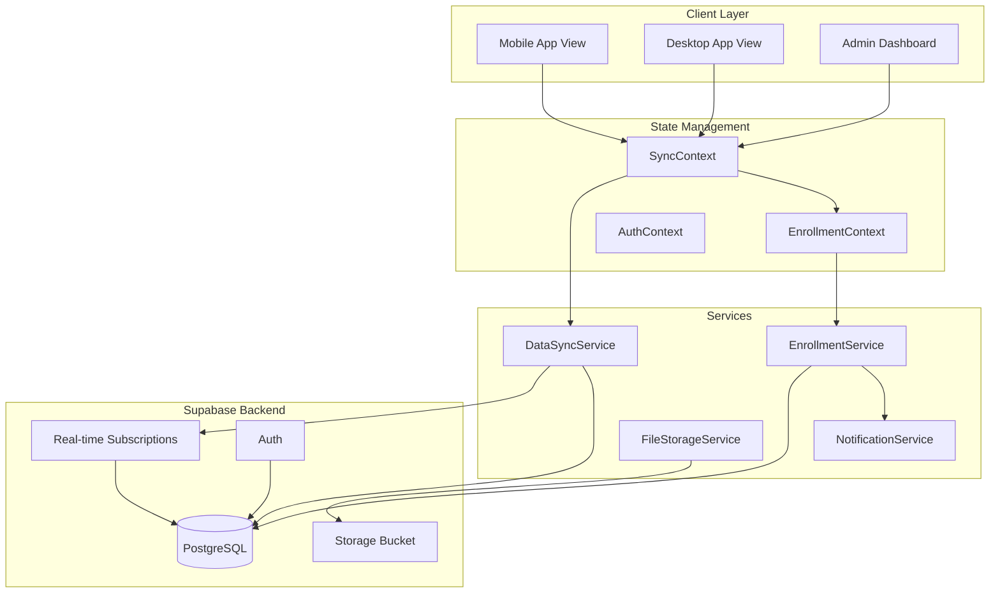

# Design Document: Mobile, Sync & Admin Dashboard Overhaul

## Overview

This design addresses three critical areas of the Beta Skills platform:

1. **Mobile Responsiveness**: Complete overhaul of mobile layouts to eliminate overlapping elements, ensure proper text visibility, and create intuitive touch-friendly navigation
2. **Cross-Device Data Synchronization**: Server-first data architecture ensuring user enrollments, progress, and state are consistent across all devices
3. **Admin Dashboard Enhancement**: Comprehensive admin interface with user management, enrollment approval/rejection, proof of payment viewing, and real-time updates

The solution leverages existing Supabase infrastructure for real-time subscriptions, implements a mobile-first CSS approach, and creates a unified data synchronization layer.

## Architecture



## Components and Interfaces

### 1. Mobile Layout Components

#### MobileHeader Component
```typescript
interface MobileHeaderProps {
  onMenuToggle: () => void;
  isMenuOpen: boolean;
  user: User | null;
}
```
- Fixed position header with hamburger menu
- Logo scales appropriately for mobile
- Touch-friendly menu button (min 44x44px)

#### MobileNavigation Component
```typescript
interface MobileNavigationProps {
  isOpen: boolean;
  onClose: () => void;
  user: User | null;
  currentPath: string;
}
```
- Full-screen overlay navigation
- Smooth slide-in animation
- Touch-friendly nav items with proper spacing
- Backdrop click to close

#### MobileCourseSidebar Component
```typescript
interface MobileCourseSidebarProps {
  course: Course;
  currentLessonId: string;
  isOpen: boolean;
  onToggle: () => void;
  onLessonSelect: (lessonId: string) => void;
}
```
- Collapsible sidebar with swipe gesture support
- Full module/lesson titles (no truncation)
- Progress indicators per module
- Sticky toggle button

#### MobileLessonNavigation Component
```typescript
interface MobileLessonNavigationProps {
  currentLesson: Lesson;
  previousLesson: Lesson | null;
  nextLesson: Lesson | null;
  onNavigate: (lessonId: string) => void;
}
```
- Fixed bottom navigation bar
- Large touch targets for prev/next
- Current lesson indicator
- Swipe gesture support

### 2. Data Synchronization Components

#### DataSyncService
```typescript
interface SyncState {
  isOnline: boolean;
  isSyncing: boolean;
  lastSyncTimestamp: string | null;
  pendingOperations: SyncOperation[];
  connectionStatus: 'connected' | 'disconnected' | 'reconnecting';
}

interface SyncOperation {
  id: string;
  type: 'enrollment' | 'progress' | 'profile';
  action: 'create' | 'update' | 'delete';
  data: any;
  timestamp: string;
  retryCount: number;
}

class DataSyncService {
  // Singleton instance
  static getInstance(): DataSyncService;
  
  // Core sync methods
  syncUserData(userId: string): Promise<void>;
  queueOperation(operation: SyncOperation): void;
  processQueue(): Promise<void>;
  
  // Conflict resolution
  resolveConflict(local: any, remote: any): any;
  
  // Connection management
  onConnectionChange(callback: (isOnline: boolean) => void): () => void;
  reconnect(): Promise<void>;
}
```

#### EnrollmentSyncService
```typescript
interface EnrollmentData {
  id: string;
  userId: string;
  userEmail: string;
  courseId: string;
  courseTitle: string;
  status: 'pending' | 'approved' | 'rejected';
  enrolledAt: string;
  approvedAt?: string;
  rejectedAt?: string;
  rejectionReason?: string;
  proofOfPaymentUrl?: string;
  progress: number;
  lastActivityAt: string;
}

class EnrollmentSyncService {
  // Fetch enrollments from server (source of truth)
  fetchUserEnrollments(userId: string): Promise<EnrollmentData[]>;
  
  // Real-time subscription
  subscribeToEnrollmentChanges(
    userId: string, 
    callback: (enrollment: EnrollmentData) => void
  ): () => void;
  
  // Admin subscriptions
  subscribeToAllEnrollments(
    callback: (enrollment: EnrollmentData) => void
  ): () => void;
}
```

### 3. Admin Dashboard Components

#### AdminDashboard Component
```typescript
interface AdminDashboardProps {
  // No props - uses context for data
}

interface AdminDashboardState {
  activeTab: 'overview' | 'users' | 'enrollments' | 'progress';
  filters: FilterState;
  selectedUser: User | null;
  selectedEnrollment: EnrollmentData | null;
}
```

#### UserManagementPanel Component
```typescript
interface UserManagementPanelProps {
  users: User[];
  totalCount: number;
  currentPage: number;
  onPageChange: (page: number) => void;
  onSearch: (query: string) => void;
  onUserSelect: (user: User) => void;
}

interface User {
  id: string;
  email: string;
  firstName: string;
  lastName: string;
  phone?: string;
  registeredAt: string;
  lastLoginAt?: string;
  status: 'active' | 'inactive' | 'suspended';
  enrollmentCount: number;
}
```

#### EnrollmentManagementPanel Component
```typescript
interface EnrollmentManagementPanelProps {
  enrollments: EnrollmentData[];
  onApprove: (enrollmentId: string) => Promise<void>;
  onReject: (enrollmentId: string, reason: string) => Promise<void>;
  onViewProof: (proofUrl: string) => void;
}
```

#### ProofOfPaymentViewer Component
```typescript
interface ProofOfPaymentViewerProps {
  url: string;
  fileType: 'image' | 'pdf';
  onClose: () => void;
  onDownload: () => void;
}
```
- Modal overlay for viewing proof
- Image zoom/pan for images
- PDF viewer for documents
- Download button for all types

#### ProgressTrackingPanel Component
```typescript
interface ProgressTrackingPanelProps {
  courseId?: string;
  userId?: string;
  dateRange?: { start: Date; end: Date };
}

interface UserProgress {
  userId: string;
  userName: string;
  courseId: string;
  courseTitle: string;
  progressPercentage: number;
  completedModules: number;
  totalModules: number;
  quizScores: QuizScore[];
  lastActivityAt: string;
}

interface QuizScore {
  moduleId: string;
  moduleName: string;
  score: number;
  maxScore: number;
  completedAt: string;
}
```

### 4. File Upload Components

#### ProofOfPaymentUpload Component
```typescript
interface ProofOfPaymentUploadProps {
  enrollmentId: string;
  onUploadComplete: (url: string) => void;
  onError: (error: string) => void;
  maxSizeMB?: number; // Default 10MB
  acceptedTypes?: string[]; // Default ['image/jpeg', 'image/png', 'application/pdf']
}
```

## Data Models

### Database Schema Updates

```sql
-- Add proof_of_payment_url to enrollments table
ALTER TABLE enrollments ADD COLUMN IF NOT EXISTS proof_of_payment_url TEXT;
ALTER TABLE enrollments ADD COLUMN IF NOT EXISTS rejection_reason TEXT;
ALTER TABLE enrollments ADD COLUMN IF NOT EXISTS rejected_at TIMESTAMP WITH TIME ZONE;
ALTER TABLE enrollments ADD COLUMN IF NOT EXISTS last_activity_at TIMESTAMP WITH TIME ZONE DEFAULT NOW();

-- Add phone to profiles if not exists
ALTER TABLE profiles ADD COLUMN IF NOT EXISTS phone TEXT;
ALTER TABLE profiles ADD COLUMN IF NOT EXISTS last_login_at TIMESTAMP WITH TIME ZONE;
ALTER TABLE profiles ADD COLUMN IF NOT EXISTS status TEXT DEFAULT 'active';

-- Create user_progress table for detailed tracking
CREATE TABLE IF NOT EXISTS user_progress (
  id UUID PRIMARY KEY DEFAULT gen_random_uuid(),
  user_id UUID REFERENCES auth.users(id) ON DELETE CASCADE,
  course_id TEXT NOT NULL,
  module_id TEXT NOT NULL,
  lesson_id TEXT NOT NULL,
  completed BOOLEAN DEFAULT FALSE,
  completed_at TIMESTAMP WITH TIME ZONE,
  quiz_score INTEGER,
  quiz_max_score INTEGER,
  created_at TIMESTAMP WITH TIME ZONE DEFAULT NOW(),
  updated_at TIMESTAMP WITH TIME ZONE DEFAULT NOW(),
  UNIQUE(user_id, course_id, lesson_id)
);

-- Create index for faster queries
CREATE INDEX IF NOT EXISTS idx_user_progress_user_course ON user_progress(user_id, course_id);
CREATE INDEX IF NOT EXISTS idx_enrollments_status ON enrollments(status);
CREATE INDEX IF NOT EXISTS idx_enrollments_user ON enrollments(user_id);
```

### TypeScript Interfaces

```typescript
// Enrollment with full details for admin
interface AdminEnrollmentView {
  id: string;
  user: {
    id: string;
    email: string;
    firstName: string;
    lastName: string;
    phone?: string;
    registeredAt: string;
  };
  course: {
    id: string;
    title: string;
    thumbnail?: string;
  };
  status: 'pending' | 'approved' | 'rejected';
  enrolledAt: string;
  approvedAt?: string;
  rejectedAt?: string;
  rejectionReason?: string;
  proofOfPaymentUrl?: string;
  progress: number;
  lastActivityAt: string;
}

// Statistics for dashboard
interface DashboardStats {
  totalUsers: number;
  newUsersLast30Days: number;
  activeUsers: number;
  totalEnrollments: number;
  pendingEnrollments: number;
  approvedEnrollments: number;
  rejectedEnrollments: number;
  averageProgress: number;
  courseStats: CourseStats[];
}

interface CourseStats {
  courseId: string;
  courseTitle: string;
  enrollmentCount: number;
  completionRate: number;
  averageProgress: number;
}
```

## Correctness Properties

*A property is a characteristic or behavior that should hold true across all valid executions of a system-essentially, a formal statement about what the system should do. Properties serve as the bridge between human-readable specifications and machine-verifiable correctness guarantees.*

Based on the prework analysis, the following correctness properties must be validated:

### Property 1: Mobile Layout No Horizontal Overflow
*For any* page rendered on a mobile viewport (width < 768px), no element SHALL have a computed width greater than the viewport width, ensuring no horizontal scrolling is required.
**Validates: Requirements 1.1**

### Property 2: Touch Target Minimum Size
*For any* interactive element (buttons, links, form controls) displayed on a mobile viewport, the element SHALL have minimum dimensions of 44x44 pixels.
**Validates: Requirements 1.2, 2.2**

### Property 3: Mobile Text Minimum Font Size
*For any* body text element displayed on a mobile viewport, the computed font-size SHALL be at least 16px.
**Validates: Requirements 1.3**

### Property 4: Mobile Course Cards Vertical Stack
*For any* course card grid displayed on a mobile viewport, cards SHALL be arranged in a single column with a minimum gap of 16px between cards.
**Validates: Requirements 1.5**

### Property 5: Mobile Lesson Content Padding
*For any* lesson content container displayed on a mobile viewport, the horizontal padding SHALL be at least 16px.
**Validates: Requirements 2.3**

### Property 6: Mobile Sidebar Text Visibility
*For any* module or lesson title in the mobile course sidebar when open, the text SHALL NOT have text-overflow: ellipsis applied.
**Validates: Requirements 2.5**

### Property 7: Cross-Device Enrollment Consistency
*For any* authenticated user, fetching enrollments on device A and then fetching enrollments on device B SHALL return identical enrollment data (same courses, same statuses, same progress).
**Validates: Requirements 3.1, 3.3**

### Property 8: Server Data Priority
*For any* authenticated user with conflicting local and server enrollment data, the system SHALL use server data as the source of truth, overwriting local data.
**Validates: Requirements 3.5**

### Property 9: Offline Sync Conflict Resolution
*For any* enrollment modified offline, when connectivity is restored, the system SHALL sync using timestamp-based last-write-wins conflict resolution.
**Validates: Requirements 3.4**

### Property 10: Admin User Profile Completeness
*For any* user displayed in the admin dashboard, the view SHALL include: email, full name (first + last), phone (if provided), registration date, and account status.
**Validates: Requirements 4.2**

### Property 11: Admin Enrollment List Completeness
*For any* enrollment displayed in the admin pending list, the view SHALL include: user email, user name, course title, submission timestamp, and proof of payment status.
**Validates: Requirements 5.1, 5.2**

### Property 12: Admin Search Filter Accuracy
*For any* search query applied to users or enrollments, the results SHALL contain only items matching the search criteria (email contains query OR name contains query).
**Validates: Requirements 4.3, 6.3**

### Property 13: Enrollment Action Notification
*For any* enrollment approval or rejection action, the system SHALL update the enrollment status in the database AND trigger a notification to the affected user.
**Validates: Requirements 5.4, 5.5**

### Property 14: Real-Time Enrollment Submission
*For any* new enrollment submission, the admin dashboard SHALL display the enrollment within 3 seconds via real-time subscription.
**Validates: Requirements 7.1**

### Property 15: Real-Time Status Propagation to User
*For any* enrollment status change by admin, the user's dashboard SHALL reflect the change within 3 seconds via real-time subscription.
**Validates: Requirements 7.2**

### Property 16: Real-Time Admin Session Sync
*For any* enrollment status change, all active admin dashboard sessions SHALL display the updated status within 3 seconds.
**Validates: Requirements 7.3**

### Property 17: Reconnection Data Refresh
*For any* real-time connection restoration after disconnection, the system SHALL fetch and display all updates that occurred during the disconnection period.
**Validates: Requirements 7.5**

### Property 18: File Upload Validation
*For any* file submitted as proof of payment, the system SHALL accept only files with MIME type in [image/jpeg, image/png, application/pdf] AND size <= 10MB.
**Validates: Requirements 8.2**

### Property 19: Proof of Payment Enrollment Link
*For any* successfully uploaded proof of payment, the file URL SHALL be stored in the enrollment record's proof_of_payment_url field.
**Validates: Requirements 8.3**

### Property 20: Missing Proof Indicator
*For any* enrollment without a proof_of_payment_url, the admin dashboard SHALL display a "Missing Proof" indicator.
**Validates: Requirements 8.5**

## Error Handling

### Network Errors
- Display connection status indicator in header
- Queue failed operations for retry
- Show toast notifications for sync failures
- Automatic reconnection with exponential backoff

### File Upload Errors
- Validate file type and size before upload
- Show progress indicator during upload
- Display clear error messages for failures
- Allow retry without re-selecting file

### Real-Time Subscription Errors
- Automatic reconnection on subscription failure
- Fallback to polling if real-time unavailable
- Log errors for debugging

### Data Validation Errors
- Validate all form inputs before submission
- Display inline validation errors
- Prevent submission of invalid data

## Testing Strategy

### Dual Testing Approach

This feature requires both unit tests and property-based tests:

#### Unit Tests
- Component rendering tests for mobile layouts
- Service method tests for data sync
- Admin action tests (approve/reject)
- File upload validation tests

#### Property-Based Tests

**Testing Library**: fast-check (JavaScript property-based testing library)

Each correctness property will be implemented as a property-based test with minimum 100 iterations.

**Test Configuration**:
```typescript
import fc from 'fast-check';

// Configure minimum iterations
const testConfig = { numRuns: 100 };
```

**Generator Strategy**:
- Generate random viewport widths for mobile tests (320-767px)
- Generate random user data for admin tests
- Generate random enrollment data for sync tests
- Generate random file metadata for upload validation tests

**Test Annotations**:
Each property-based test will be annotated with:
```typescript
/**
 * Feature: mobile-sync-admin-overhaul, Property {N}: {property_text}
 * Validates: Requirements X.Y
 */
```

### Integration Tests
- End-to-end enrollment flow (user submits → admin approves → user sees access)
- Cross-device sync simulation
- Real-time update propagation
- File upload and retrieval flow
