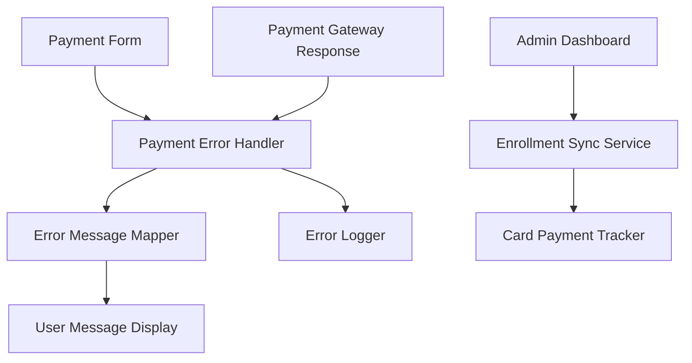

# Design Document

## Overview

This design outlines the implementation of an enhanced payment error messaging system that provides users with specific, actionable error messages when payment transactions fail. The system will replace generic error messages with detailed information about decline reasons and provide clear guidance on resolution steps. Additionally, this design addresses the issue where card payment enrollments are not appearing in the admin dashboard.

## Architecture

### Core Components



### Error Flow Architecture

1. **Payment Gateway Response** → Raw error codes and messages
2. **Payment Error Handler** → Processes and categorizes errors
3. **Error Message Mapper** → Translates technical errors to user-friendly messages
4. **User Message Display** → Shows formatted messages with actions
5. **Error Logger** → Records errors for analysis and debugging

## Components and Interfaces

### 1. PaymentErrorHandler Service

**Purpose**: Central service for processing payment errors and mapping them to user-friendly messages.

**Interface**:
```typescript
interface PaymentErrorHandler {
  processPaymentError(error: PaymentError): ProcessedPaymentError;
  getErrorMessage(errorCode: string, context?: ErrorContext): UserErrorMessage;
  logPaymentError(error: PaymentError, context: ErrorContext): void;
}

interface PaymentError {
  code: string;
  message: string;
  details?: any;
  source: 'ikhokha' | 'validation' | 'network' | 'system';
}

interface ProcessedPaymentError {
  userMessage: UserErrorMessage;
  severity: 'low' | 'medium' | 'high' | 'critical';
  category: 'card' | 'network' | 'system' | 'validation';
  actionable: boolean;
}

interface UserErrorMessage {
  title: string;
  description: string;
  actions: ErrorAction[];
  icon: string;
  variant: 'destructive' | 'warning' | 'info';
}

interface ErrorAction {
  label: string;
  action: 'retry' | 'contact_support' | 'try_eft' | 'try_different_card';
  primary?: boolean;
}
```

### 2. ErrorMessageMapper Utility

**Purpose**: Maps payment gateway error codes to standardized user messages.

**Key Features**:
- Centralized error code mapping
- Context-aware message generation
- Fallback message handling
- Multi-language support ready

**Error Categories**:
- **Card Declined**: Insufficient funds, expired card, invalid CVV, blocked card
- **Network Issues**: Timeout, gateway unavailable, connection errors
- **Validation Errors**: Invalid card details, format errors
- **System Errors**: Internal errors, service unavailable
- **Test Mode**: Test card guidance, development mode messages

### 3. Enhanced PaymentForm Component

**Purpose**: Updated payment form with improved error display and handling.

**Key Enhancements**:
- Specific error message display
- Action buttons for error resolution
- Visual error indicators
- Progressive error guidance

### 4. CardPaymentEnrollmentTracker Service

**Purpose**: Ensures card payment enrollments are properly tracked and visible in admin dashboard.

**Interface**:
```typescript
interface CardPaymentEnrollmentTracker {
  trackCardPayment(paymentData: CardPaymentData): Promise<void>;
  syncEnrollmentStatus(paymentId: string): Promise<EnrollmentStatus>;
  ensureAdminVisibility(enrollmentId: string): Promise<void>;
}

interface CardPaymentData {
  payment_id: string;
  course_id: string;
  user_id: string;
  amount: number;
  status: 'pending' | 'completed' | 'failed';
  payment_method: 'card';
  created_at: string;
}
```

## Data Models

### 1. Enhanced Error Logging

```sql
-- Enhanced payment_errors table
CREATE TABLE payment_errors (
  id UUID PRIMARY KEY DEFAULT gen_random_uuid(),
  payment_id VARCHAR(255),
  error_code VARCHAR(100) NOT NULL,
  error_message TEXT NOT NULL,
  user_message TEXT NOT NULL,
  error_category VARCHAR(50) NOT NULL,
  severity VARCHAR(20) NOT NULL,
  user_id UUID REFERENCES auth.users(id),
  course_id VARCHAR(100),
  payment_method VARCHAR(50),
  gateway_response JSONB,
  user_agent TEXT,
  ip_address INET,
  created_at TIMESTAMP WITH TIME ZONE DEFAULT NOW()
);
```

### 2. Card Payment Tracking

```sql
-- Enhanced enrollments table to ensure card payments are tracked
ALTER TABLE enrollments ADD COLUMN IF NOT EXISTS payment_tracking_id VARCHAR(255);
ALTER TABLE enrollments ADD COLUMN IF NOT EXISTS payment_gateway VARCHAR(50);
ALTER TABLE enrollments ADD COLUMN IF NOT EXISTS payment_status VARCHAR(50) DEFAULT 'pending';

-- Index for admin dashboard queries
CREATE INDEX IF NOT EXISTS idx_enrollments_payment_method ON enrollments(payment_method);
CREATE INDEX IF NOT EXISTS idx_enrollments_payment_status ON enrollments(payment_status);
```

### 3. Error Message Templates

```typescript
interface ErrorMessageTemplate {
  code: string;
  category: string;
  title: string;
  description: string;
  actions: string[];
  severity: string;
  context_variables?: string[];
}
```

## Error Handling Strategy

### 1. Error Code Mapping

**Card Decline Errors**:
- `INSUFFICIENT_FUNDS` → "Payment declined: Insufficient funds. Please check your account balance or try a different card."
- `EXPIRED_CARD` → "Payment declined: Your card has expired. Please use a different card or contact your bank."
- `INVALID_CVV` → "Payment declined: Invalid security code (CVV). Please check the 3-digit code on the back of your card."
- `CARD_BLOCKED` → "Payment declined: Your card has been blocked. Please contact your bank or try a different card."

**Network/System Errors**:
- `TIMEOUT` → "Payment timeout: Connection to payment gateway timed out. Please check your internet connection and try again."
- `GATEWAY_UNAVAILABLE` → "Payment service temporarily unavailable: Please try again in a few minutes or use the EFT payment option."
- `SYSTEM_ERROR` → "System error: An unexpected error occurred. Please try again or contact support if the problem persists."

**Test Mode Errors**:
- `INVALID_TEST_CARD` → "Test mode active: Please use test card 4111 1111 1111 1111 for successful payments or try the EFT option."
- `TEST_CARD_DECLINED` → "Test card declined (simulated): This test card simulates a declined payment. Try 4111 1111 1111 1111 for successful test payments."

### 2. Progressive Error Handling

1. **First Attempt**: Show specific error with primary action
2. **Second Attempt**: Add alternative payment method suggestions
3. **Third Attempt**: Emphasize support contact and EFT option
4. **Multiple Failures**: Suggest contacting bank and provide support escalation

### 3. Context-Aware Messaging

- **Development Mode**: Include test card guidance
- **Production Mode**: Focus on real payment solutions
- **Mobile Users**: Shorter, more concise messages
- **Repeat Users**: Reference previous successful payment methods

## Admin Dashboard Enhancement

### 1. Card Payment Visibility Fix

**Root Cause**: Card payments may not be properly synced to the enrollments table or may have different status tracking.

**Solution Components**:
- **EnrollmentSyncService**: Ensures all payment types are properly recorded
- **PaymentStatusTracker**: Monitors payment completion and updates enrollment status
- **AdminDashboardDataProvider**: Enhanced queries to include all payment methods

### 2. Real-time Enrollment Updates

**Implementation**:
- Webhook handlers for card payment completion
- Real-time database triggers for enrollment status updates
- Admin dashboard refresh mechanisms

## Testing Strategy

### 1. Error Message Testing

**Test Scenarios**:
- Each error code mapping
- Context-specific message variations
- Action button functionality
- Visual display consistency

**Test Cards for Error Simulation**:
- `4000000000000002` - Generic decline
- `4000000000000069` - Expired card
- `4000000000000127` - Incorrect CVV
- `4000000000000119` - Processing error

### 2. Admin Dashboard Testing

**Test Scenarios**:
- Card payment enrollment visibility
- Real-time status updates
- Cross-payment-method consistency
- Historical data accuracy

### 3. Integration Testing

**Test Flows**:
- End-to-end payment error handling
- Admin dashboard enrollment sync
- Multi-user concurrent payment scenarios
- Error recovery and retry mechanisms

## Implementation Phases

### Phase 1: Core Error Handling
- PaymentErrorHandler service
- ErrorMessageMapper utility
- Basic error message templates
- Enhanced PaymentForm error display

### Phase 2: Admin Dashboard Fix
- CardPaymentEnrollmentTracker service
- Database schema updates
- Admin dashboard query enhancements
- Real-time sync implementation

### Phase 3: Advanced Features
- Progressive error handling
- Context-aware messaging
- Comprehensive error logging
- Analytics and monitoring

### Phase 4: Testing and Optimization
- Comprehensive test coverage
- Performance optimization
- User experience refinement
- Documentation and training

## Security Considerations

### 1. Error Information Disclosure
- Sanitize technical error details in user messages
- Log full error details securely for debugging
- Prevent sensitive information leakage

### 2. Payment Data Protection
- Encrypt payment error logs
- Implement data retention policies
- Ensure PCI compliance for error handling

### 3. Admin Dashboard Security
- Role-based access to payment error logs
- Audit trail for admin actions
- Secure payment status updates

## Performance Considerations

### 1. Error Processing
- Async error logging to prevent payment flow blocking
- Cached error message templates
- Efficient error code lookup

### 2. Admin Dashboard
- Optimized queries for enrollment data
- Pagination for large datasets
- Real-time updates without performance impact

### 3. Database Optimization
- Proper indexing for error and enrollment queries
- Efficient data archiving strategies
- Connection pooling for high-volume scenarios