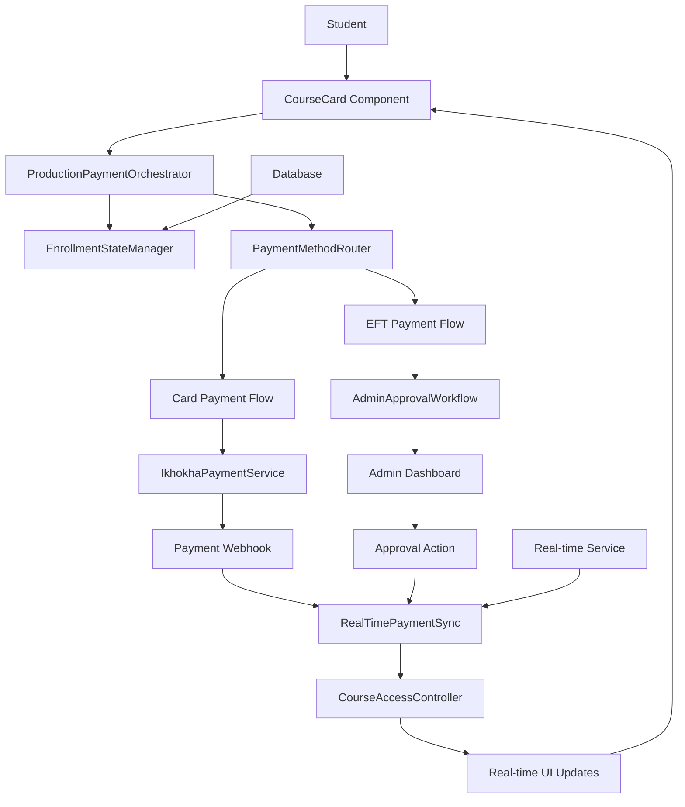
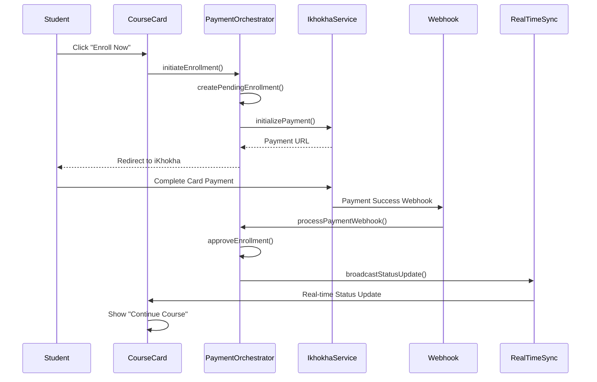
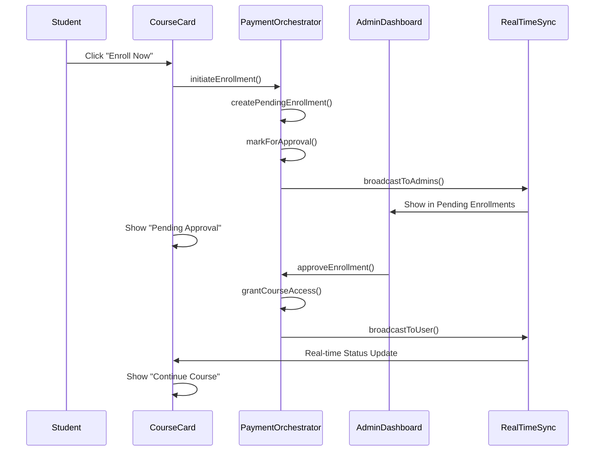

# Design Document

## Overview

The production iKhokha payment integration creates a seamless, real-money payment system for the online learning platform. This design builds upon the existing iKhokha service foundation to deliver production-ready payment processing with proper enrollment logic, real-time status updates, and comprehensive admin approval workflows. The system ensures that card payments provide immediate course access while EFT payments require admin approval, all while maintaining real-time synchronization across the platform.

## Architecture

### Core System Components

1. **ProductionPaymentOrchestrator**: Main coordinator for production payment flows
2. **EnrollmentStateManager**: Manages enrollment status transitions and business logic
3. **RealTimePaymentSync**: Handles real-time payment and enrollment status updates
4. **AdminApprovalWorkflow**: Manages EFT payment approval processes
5. **PaymentMethodRouter**: Routes payments based on type (card vs EFT)
6. **CourseAccessController**: Controls course content access based on enrollment status

### System Architecture Flow



## Components and Interfaces

### ProductionPaymentOrchestrator Interface

```typescript
interface ProductionPaymentOrchestrator {
  // Main enrollment flow
  initiateEnrollment(courseId: string, userId: string): Promise<EnrollmentResult>
  processPayment(paymentData: PaymentRequest): Promise<PaymentResult>
  
  // Status management
  getEnrollmentStatus(courseId: string, userId: string): Promise<EnrollmentStatus>
  updateEnrollmentStatus(enrollmentId: string, status: EnrollmentStatus): Promise<void>
  
  // Real-time subscriptions
  subscribeToEnrollmentUpdates(userId: string, callback: StatusUpdateCallback): () => void
  
  // Production validation
  validateProductionReadiness(): ProductionValidation
}
```

### EnrollmentStateManager Interface

```typescript
interface EnrollmentStateManager {
  // State transitions
  createPendingEnrollment(courseId: string, userId: string): Promise<Enrollment>
  approveEnrollment(enrollmentId: string, approvedBy: string): Promise<void>
  rejectEnrollment(enrollmentId: string, reason: string): Promise<void>
  
  // Status queries
  getEnrollmentState(courseId: string, userId: string): EnrollmentState
  canAccessCourse(courseId: string, userId: string): boolean
  
  // Business logic
  determinePaymentType(paymentMethod: string): PaymentType
  shouldRequireApproval(paymentType: PaymentType): boolean
}
```

### RealTimePaymentSync Interface

```typescript
interface RealTimePaymentSync {
  // Payment status sync
  syncPaymentStatus(paymentId: string, status: PaymentStatus): Promise<void>
  syncEnrollmentStatus(enrollmentId: string, status: EnrollmentStatus): Promise<void>
  
  // Real-time broadcasting
  broadcastStatusUpdate(update: StatusUpdate): void
  broadcastToUser(userId: string, update: UserUpdate): void
  broadcastToAdmins(update: AdminUpdate): void
  
  // Cross-tab synchronization
  syncAcrossTabs(userId: string, data: SyncData): void
}
```

## Data Models

### Enhanced Enrollment Model

```typescript
interface ProductionEnrollment {
  id: string
  user_id: string
  user_email: string
  course_id: string
  course_title: string
  status: 'pending' | 'approved' | 'rejected'
  
  // Payment information
  payment_type: 'card' | 'eft' | 'manual'
  payment_status: 'pending' | 'processing' | 'completed' | 'failed'
  payment_reference?: string
  ikhokha_transaction_id?: string
  
  // Approval workflow
  requires_approval: boolean
  approved_by?: string
  approved_at?: Date
  rejection_reason?: string
  
  // Timestamps
  created_at: Date
  updated_at: Date
  
  // Access control
  course_access_granted: boolean
  access_granted_at?: Date
}
```

### Payment Flow State Model

```typescript
interface PaymentFlowState {
  enrollment_id: string
  current_step: PaymentStep
  payment_method: 'card' | 'eft'
  
  // Step tracking
  steps_completed: PaymentStep[]
  current_step_data: Record<string, any>
  
  // Error handling
  last_error?: PaymentError
  retry_count: number
  
  // Timing
  started_at: Date
  completed_at?: Date
  expires_at: Date
}

enum PaymentStep {
  ENROLLMENT_CREATED = 'enrollment_created',
  PAYMENT_INITIATED = 'payment_initiated',
  PAYMENT_PROCESSING = 'payment_processing',
  PAYMENT_COMPLETED = 'payment_completed',
  APPROVAL_REQUIRED = 'approval_required',
  ADMIN_APPROVED = 'admin_approved',
  COURSE_ACCESS_GRANTED = 'course_access_granted'
}
```

### Real-time Update Model

```typescript
interface StatusUpdate {
  type: 'enrollment' | 'payment' | 'approval'
  target_user_id: string
  enrollment_id: string
  course_id: string
  
  // Status information
  old_status?: string
  new_status: string
  
  // Additional data
  payment_info?: PaymentInfo
  approval_info?: ApprovalInfo
  
  // Metadata
  timestamp: Date
  source: 'payment_webhook' | 'admin_action' | 'system'
}
```

## Production Payment Flow Design

### Card Payment Flow (Immediate Access)



### EFT Payment Flow (Admin Approval Required)



## Course Card State Management

### Button State Logic

```typescript
interface CourseCardState {
  // User authentication
  isLoggedIn: boolean
  userRole: 'student' | 'admin' | 'instructor'
  
  // Enrollment status
  enrollmentStatus: 'none' | 'pending' | 'approved' | 'rejected'
  paymentStatus: 'none' | 'pending' | 'processing' | 'completed' | 'failed'
  
  // Access control
  hasAccess: boolean
  requiresApproval: boolean
  
  // UI state
  isLoading: boolean
  buttonText: string
  buttonAction: ButtonAction
  isDisabled: boolean
}

enum ButtonAction {
  REDIRECT_TO_AUTH = 'redirect_to_auth',
  INITIATE_ENROLLMENT = 'initiate_enrollment',
  SHOW_PENDING = 'show_pending',
  CONTINUE_COURSE = 'continue_course',
  RETRY_PAYMENT = 'retry_payment'
}
```

### State Transition Rules

```typescript
interface StateTransitionRules {
  // Not logged in
  notLoggedIn(): CourseCardState {
    return {
      buttonText: "Register To Enroll",
      buttonAction: ButtonAction.REDIRECT_TO_AUTH,
      isDisabled: false
    }
  }
  
  // Logged in, no enrollment
  loggedInNoEnrollment(): CourseCardState {
    return {
      buttonText: "Enroll Now",
      buttonAction: ButtonAction.INITIATE_ENROLLMENT,
      isDisabled: false
    }
  }
  
  // Pending approval (EFT payment)
  pendingApproval(): CourseCardState {
    return {
      buttonText: "Pending Approval",
      buttonAction: ButtonAction.SHOW_PENDING,
      isDisabled: true
    }
  }
  
  // Approved enrollment
  approvedEnrollment(): CourseCardState {
    return {
      buttonText: "Continue Course",
      buttonAction: ButtonAction.CONTINUE_COURSE,
      isDisabled: false
    }
  }
}
```

## Real-time Synchronization Strategy

### Cross-Tab Synchronization

```typescript
interface CrossTabSync {
  // Storage-based sync
  syncViaLocalStorage(key: string, data: any): void
  listenToStorageChanges(callback: StorageChangeCallback): () => void
  
  // Broadcast channel sync
  syncViaBroadcastChannel(channel: string, data: any): void
  listenToBroadcastChannel(channel: string, callback: MessageCallback): () => void
  
  // WebSocket sync
  syncViaWebSocket(data: any): void
  subscribeToWebSocketUpdates(callback: WebSocketCallback): () => void
}
```

### Real-time Event System

```typescript
interface RealTimeEventSystem {
  // Event types
  ENROLLMENT_CREATED: 'enrollment_created'
  ENROLLMENT_UPDATED: 'enrollment_updated'
  PAYMENT_COMPLETED: 'payment_completed'
  ADMIN_APPROVED: 'admin_approved'
  COURSE_ACCESS_GRANTED: 'course_access_granted'
  
  // Event dispatching
  dispatchEvent(eventType: string, data: EventData): void
  addEventListener(eventType: string, callback: EventCallback): () => void
  
  // User-specific events
  dispatchUserEvent(userId: string, eventType: string, data: EventData): void
  subscribeToUserEvents(userId: string, callback: UserEventCallback): () => void
}
```

## Production Configuration Management

### Environment Validation

```typescript
interface ProductionValidator {
  // Configuration validation
  validateIkhokhaConfig(): ValidationResult
  validateDatabaseConfig(): ValidationResult
  validateWebhookConfig(): ValidationResult
  
  // Security validation
  validateApiKeys(): SecurityValidation
  validateWebhookSignatures(): SecurityValidation
  validateSSLCertificates(): SecurityValidation
  
  // Performance validation
  validateDatabaseConnections(): PerformanceValidation
  validateApiResponseTimes(): PerformanceValidation
  
  // Overall readiness
  validateProductionReadiness(): ProductionReadiness
}
```

### Production Configuration Model

```typescript
interface ProductionConfig {
  // iKhokha settings
  ikhokha: {
    api_url: 'https://api.ikhokha.com' // Production endpoint
    api_key: string // Production API key
    api_secret: string // Production API secret
    webhook_secret: string // Production webhook secret
    test_mode: false // MUST be false in production
  }
  
  // Database settings
  database: {
    connection_string: string
    ssl_enabled: true
    connection_pool_size: number
  }
  
  // Security settings
  security: {
    webhook_signature_validation: true
    api_rate_limiting: true
    ssl_enforcement: true
  }
  
  // Monitoring settings
  monitoring: {
    error_tracking: true
    performance_monitoring: true
    payment_logging: true
  }
}
```

## Error Handling and Recovery

### Payment Error Recovery

```typescript
interface PaymentErrorRecovery {
  // Error classification
  classifyError(error: PaymentError): ErrorClassification
  
  // Recovery strategies
  retryPayment(paymentId: string): Promise<PaymentResult>
  fallbackToManualApproval(enrollmentId: string): Promise<void>
  notifyAdminOfError(error: PaymentError): Promise<void>
  
  // User communication
  generateUserErrorMessage(error: PaymentError): string
  suggestUserAction(error: PaymentError): UserAction
}
```

### Webhook Failure Handling

```typescript
interface WebhookFailureHandler {
  // Failure detection
  detectWebhookFailure(webhookId: string): boolean
  
  // Recovery mechanisms
  retryWebhookProcessing(webhookData: WebhookData): Promise<void>
  manualWebhookReconciliation(paymentId: string): Promise<void>
  
  // Monitoring
  logWebhookFailure(failure: WebhookFailure): void
  alertAdminOfWebhookIssues(issue: WebhookIssue): void
}
```

## Admin Dashboard Integration

### Pending Enrollments Management

```typescript
interface PendingEnrollmentsManager {
  // Data fetching
  getPendingEnrollments(): Promise<PendingEnrollment[]>
  getEnrollmentDetails(enrollmentId: string): Promise<EnrollmentDetails>
  
  // Approval actions
  approveEnrollment(enrollmentId: string, adminId: string): Promise<ApprovalResult>
  rejectEnrollment(enrollmentId: string, reason: string, adminId: string): Promise<RejectionResult>
  bulkApproveEnrollments(enrollmentIds: string[], adminId: string): Promise<BulkApprovalResult>
  
  // Real-time updates
  subscribeToNewEnrollments(callback: NewEnrollmentCallback): () => void
  notifyEnrollmentProcessed(enrollmentId: string): void
}
```

## Security Implementation

### Production Security Measures

```typescript
interface ProductionSecurity {
  // API security
  validateApiCredentials(): boolean
  rotateApiKeys(): Promise<void>
  
  // Webhook security
  validateWebhookSignature(payload: string, signature: string): boolean
  verifyWebhookSource(request: WebhookRequest): boolean
  
  // Data protection
  encryptSensitiveData(data: SensitiveData): EncryptedData
  maskPaymentInformation(paymentData: PaymentData): MaskedPaymentData
  
  // Audit logging
  logPaymentTransaction(transaction: PaymentTransaction): void
  logAdminAction(action: AdminAction): void
  logSecurityEvent(event: SecurityEvent): void
}
```

## Testing Strategy

### Production Testing Approach

```typescript
interface ProductionTestStrategy {
  // Pre-production validation
  validatePaymentFlow(): Promise<ValidationResult>
  testWebhookHandling(): Promise<TestResult>
  verifyRealTimeUpdates(): Promise<TestResult>
  
  // Load testing
  simulateHighTraffic(): Promise<LoadTestResult>
  testConcurrentEnrollments(): Promise<ConcurrencyTestResult>
  
  // Security testing
  testWebhookSecurity(): Promise<SecurityTestResult>
  validateDataEncryption(): Promise<EncryptionTestResult>
  
  // Integration testing
  testEndToEndFlow(): Promise<E2ETestResult>
  validateAdminWorkflow(): Promise<AdminTestResult>
}
```

## Monitoring and Analytics

### Production Monitoring

```typescript
interface ProductionMonitoring {
  // Payment metrics
  trackPaymentSuccess(): void
  trackPaymentFailures(): void
  trackPaymentLatency(): void
  
  // Enrollment metrics
  trackEnrollmentConversion(): void
  trackApprovalTimes(): void
  trackUserExperience(): void
  
  // System health
  monitorApiHealth(): HealthStatus
  monitorDatabaseHealth(): HealthStatus
  monitorWebhookHealth(): HealthStatus
  
  // Alerting
  alertOnPaymentFailures(threshold: number): void
  alertOnWebhookFailures(threshold: number): void
  alertOnSystemErrors(severity: ErrorSeverity): void
}
```

## Deployment Considerations

### Production Deployment Checklist

```typescript
interface DeploymentChecklist {
  // Configuration validation
  validateEnvironmentVariables(): boolean
  validateDatabaseMigrations(): boolean
  validateApiEndpoints(): boolean
  
  // Security validation
  validateSSLCertificates(): boolean
  validateApiKeyRotation(): boolean
  validateWebhookSecurity(): boolean
  
  // Performance validation
  validateDatabasePerformance(): boolean
  validateApiResponseTimes(): boolean
  validateRealTimePerformance(): boolean
  
  // Monitoring setup
  setupErrorTracking(): boolean
  setupPerformanceMonitoring(): boolean
  setupPaymentLogging(): boolean
  
  // Rollback preparation
  prepareRollbackPlan(): boolean
  validateRollbackProcedure(): boolean
}
```

This design ensures a production-ready iKhokha payment integration that handles real money transactions, provides seamless user experience, and maintains proper enrollment logic with real-time updates across the platform.