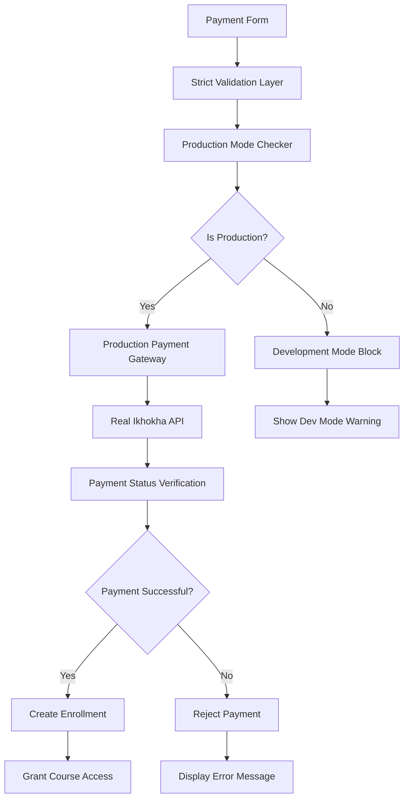

# Design Document

## Overview

This design addresses the critical production issue where the payment system is accepting payments from cards without sufficient funds by implementing strict payment validation, removing fallback mechanisms, and ensuring only legitimate payments are processed through real banking validation.

The current system has multiple fallback and simulation mechanisms that bypass real payment validation, allowing invalid payments to succeed. This design eliminates these issues by enforcing strict production payment validation through the Ikhokha payment gateway.

## Architecture

### Current System Issues

1. **Fallback Payment Processing**: The system uses fallback mechanisms that create fake successful payments
2. **Simulation Mode in Production**: Payment simulation bypasses real card validation
3. **Weak Configuration Validation**: Production credentials are not strictly enforced
4. **Missing Payment Verification**: No verification of actual payment status with the gateway
5. **Graceful Failure**: System "fails gracefully" by allowing invalid payments to succeed

### New Architecture Design



## Components and Interfaces

### 1. Strict Payment Validator

**Purpose**: Enforce production payment validation rules and prevent fallback mechanisms.

**Interface**:
```typescript
interface StrictPaymentValidator {
  validateProductionMode(): ProductionValidationResult;
  validateCredentials(): CredentialValidationResult;
  validateCardDetails(cardData: CardDetails): CardValidationResult;
  preventFallbackMechanisms(): void;
  enforceRealPaymentProcessing(): void;
}

interface ProductionValidationResult {
  isProduction: boolean;
  hasValidCredentials: boolean;
  canProcessRealPayments: boolean;
  errors: string[];
  blockPaymentProcessing: boolean;
}
```

### 2. Real Payment Gateway Service

**Purpose**: Handle actual payment processing through Ikhokha without fallbacks.

**Interface**:
```typescript
interface RealPaymentGatewayService {
  processRealPayment(request: PaymentRequest): Promise<PaymentResult>;
  verifyPaymentStatus(paymentId: string): Promise<PaymentStatus>;
  validateBankResponse(response: BankResponse): boolean;
  handlePaymentFailure(error: PaymentError): PaymentFailureResult;
}

interface PaymentRequest {
  cardDetails: ValidatedCardDetails;
  amount: number;
  currency: string;
  merchantInfo: MerchantInfo;
}

interface PaymentResult {
  success: boolean;
  paymentId?: string;
  bankTransactionId?: string;
  errorCode?: string;
  errorMessage?: string;
  requiresVerification: boolean;
}
```

### 3. Production Configuration Enforcer

**Purpose**: Ensure production environment has valid credentials and configuration.

**Interface**:
```typescript
interface ProductionConfigurationEnforcer {
  enforceProductionCredentials(): void;
  validateEnvironmentVariables(): ConfigValidationResult;
  blockTestCredentials(): void;
  requireHTTPS(): void;
  validateAPIEndpoints(): void;
}

interface ConfigValidationResult {
  isValid: boolean;
  missingVariables: string[];
  invalidCredentials: string[];
  securityIssues: string[];
  canProceed: boolean;
}
```

### 4. Payment Status Verifier

**Purpose**: Verify payment status with the banking system before granting access.

**Interface**:
```typescript
interface PaymentStatusVerifier {
  verifyWithBank(paymentId: string): Promise<BankVerificationResult>;
  waitForPaymentConfirmation(paymentId: string): Promise<PaymentConfirmation>;
  handlePendingPayments(paymentId: string): Promise<PendingPaymentResult>;
  validatePaymentAmount(expected: number, actual: number): boolean;
}

interface BankVerificationResult {
  isVerified: boolean;
  status: 'approved' | 'declined' | 'pending' | 'failed';
  bankReference: string;
  amount: number;
  currency: string;
  timestamp: string;
}
```

## Data Models

### Payment Transaction Model

```typescript
interface PaymentTransaction {
  id: string;
  userId: string;
  courseId: string;
  amount: number;
  currency: string;
  status: 'pending' | 'processing' | 'approved' | 'declined' | 'failed';
  paymentMethod: 'card';
  gatewayProvider: 'ikhokha';
  gatewayTransactionId?: string;
  bankTransactionId?: string;
  cardLast4?: string;
  cardType?: string;
  createdAt: string;
  updatedAt: string;
  verifiedAt?: string;
  failureReason?: string;
  metadata: PaymentMetadata;
}

interface PaymentMetadata {
  ipAddress: string;
  userAgent: string;
  sessionId: string;
  attemptNumber: number;
  validationChecks: ValidationCheck[];
  securityFlags: SecurityFlag[];
}
```

### Card Validation Model

```typescript
interface CardValidationResult {
  isValid: boolean;
  checks: {
    luhnAlgorithm: boolean;
    expiryDate: boolean;
    cvvFormat: boolean;
    cardholderName: boolean;
    cardType: string;
  };
  errors: string[];
  securityFlags: string[];
}

interface ValidatedCardDetails {
  maskedNumber: string;
  expiryMonth: string;
  expiryYear: string;
  cardType: string;
  issuerCountry?: string;
  isDebit: boolean;
  validationScore: number;
}
```

## Error Handling

### 1. Payment Validation Errors

```typescript
enum PaymentValidationError {
  INVALID_CARD_NUMBER = 'INVALID_CARD_NUMBER',
  EXPIRED_CARD = 'EXPIRED_CARD',
  INVALID_CVV = 'INVALID_CVV',
  INSUFFICIENT_FUNDS = 'INSUFFICIENT_FUNDS',
  CARD_DECLINED = 'CARD_DECLINED',
  FRAUD_DETECTED = 'FRAUD_DETECTED',
  GATEWAY_ERROR = 'GATEWAY_ERROR',
  CONFIGURATION_ERROR = 'CONFIGURATION_ERROR'
}

interface PaymentError {
  code: PaymentValidationError;
  message: string;
  userMessage: string;
  retryable: boolean;
  suggestedAction: string;
}
```

### 2. Production Configuration Errors

```typescript
enum ConfigurationError {
  MISSING_CREDENTIALS = 'MISSING_CREDENTIALS',
  INVALID_CREDENTIALS = 'INVALID_CREDENTIALS',
  TEST_CREDENTIALS_IN_PRODUCTION = 'TEST_CREDENTIALS_IN_PRODUCTION',
  INSECURE_ENDPOINT = 'INSECURE_ENDPOINT',
  MISSING_ENVIRONMENT_VARIABLES = 'MISSING_ENVIRONMENT_VARIABLES'
}

interface ConfigurationErrorHandler {
  handleMissingCredentials(): void;
  handleInvalidCredentials(): void;
  handleTestCredentialsInProduction(): void;
  blockPaymentProcessing(reason: string): void;
  alertAdministrators(error: ConfigurationError): void;
}
```

### 3. Error Recovery Strategy

- **No Fallback Mechanisms**: Remove all fallback payment processing
- **Strict Failure Handling**: Display clear error messages without processing invalid payments
- **Administrative Alerts**: Notify administrators of configuration issues
- **User Guidance**: Provide clear instructions for payment failures
- **Audit Logging**: Log all payment attempts and failures for security analysis

## Testing Strategy

### 1. Production Validation Tests

```typescript
describe('Production Payment Validation', () => {
  test('should reject payments with insufficient funds');
  test('should reject expired cards');
  test('should reject invalid card numbers');
  test('should block test credentials in production');
  test('should require HTTPS in production');
  test('should validate environment variables');
  test('should prevent fallback mechanisms');
});
```

### 2. Integration Tests

```typescript
describe('Real Payment Gateway Integration', () => {
  test('should process valid payments through Ikhokha');
  test('should verify payment status with bank');
  test('should handle gateway timeouts');
  test('should validate webhook signatures');
  test('should handle declined payments correctly');
});
```

### 3. Security Tests

```typescript
describe('Payment Security', () => {
  test('should detect and prevent fraud attempts');
  test('should validate card details using Luhn algorithm');
  test('should rate limit payment attempts');
  test('should log security events');
  test('should encrypt sensitive payment data');
});
```

### 4. Configuration Tests

```typescript
describe('Production Configuration', () => {
  test('should validate production credentials');
  test('should block development credentials');
  test('should require secure endpoints');
  test('should validate webhook configuration');
  test('should check environment variable completeness');
});
```

## Implementation Phases

### Phase 1: Remove Fallback Mechanisms
- Disable all payment simulation features in production
- Remove fallback payment processing logic
- Block direct payment creation without gateway validation
- Implement strict production mode checking

### Phase 2: Implement Real Payment Validation
- Integrate with real Ikhokha payment gateway
- Implement card validation using industry standards
- Add payment status verification with banking system
- Implement proper error handling for declined payments

### Phase 3: Enforce Production Configuration
- Validate production credentials on startup
- Block test credentials in production environment
- Require HTTPS for all payment endpoints
- Implement configuration validation checks

### Phase 4: Add Security and Monitoring
- Implement fraud detection mechanisms
- Add payment attempt rate limiting
- Create audit logging for all payment transactions
- Set up monitoring and alerting for payment failures

## Security Considerations

### 1. Card Data Protection
- Never store full card numbers
- Encrypt sensitive payment data in transit
- Use secure tokenization for card references
- Implement PCI DSS compliance measures

### 2. Fraud Prevention
- Implement velocity checking for payment attempts
- Monitor for suspicious payment patterns
- Use device fingerprinting for fraud detection
- Implement geographic validation for payments

### 3. Configuration Security
- Store credentials in secure environment variables
- Rotate API keys regularly
- Use webhook signature validation
- Implement IP whitelisting for webhook endpoints

### 4. Audit and Compliance
- Log all payment transactions with timestamps
- Maintain audit trails for compliance
- Implement data retention policies
- Provide audit reports for financial reconciliation

## Monitoring and Alerting

### 1. Payment Metrics
- Payment success/failure rates
- Average payment processing time
- Gateway response times
- Card validation failure reasons

### 2. Security Alerts
- Multiple failed payment attempts
- Suspicious payment patterns
- Configuration validation failures
- Fraud detection triggers

### 3. System Health
- Gateway connectivity status
- Database connection health
- Environment configuration status
- Webhook delivery success rates

This design ensures that only legitimate payments with sufficient funds are processed, eliminating the current issues with fallback mechanisms and simulation modes that allow invalid payments to succeed.