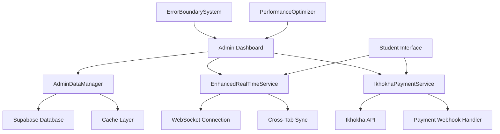
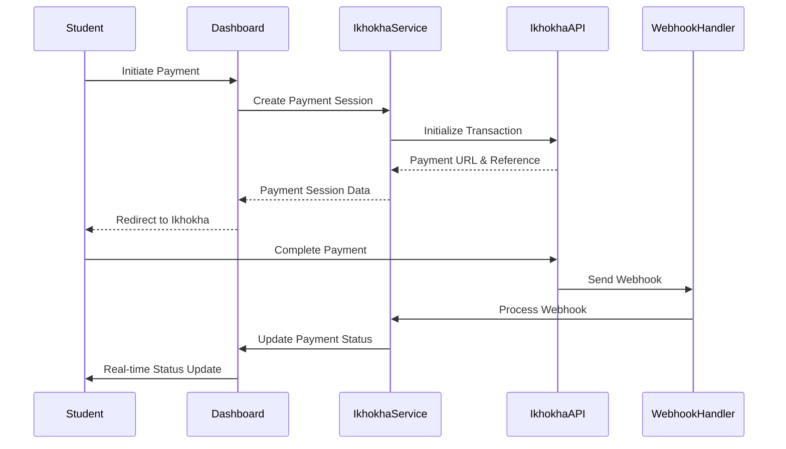

# Design Document

## Overview

The smooth admin dashboard with Ikhokha payment gateway integration creates a professional-grade administrative interface that provides real-time enrollment management, seamless payment processing, and error-free operation. The system builds upon the existing real-time enrollment infrastructure while introducing Ikhokha payment capabilities, advanced performance optimizations, and comprehensive error handling to ensure a smooth user experience.

## Architecture

### Core Components

1. **SmoothAdminDashboard**: Enhanced admin interface with optimized performance and real-time updates
2. **IkhokhaPaymentService**: Comprehensive Ikhokha payment gateway integration
3. **EnhancedRealTimeService**: Upgraded real-time service with improved error handling and performance
4. **AdminDataManager**: Centralized data management with caching and optimization
5. **ErrorBoundarySystem**: Comprehensive error handling and recovery mechanisms
6. **PerformanceOptimizer**: Advanced performance monitoring and optimization

### System Architecture



## Components and Interfaces

### SmoothAdminDashboard Interface

```typescript
interface SmoothAdminDashboard {
  // Core dashboard functionality
  loadDashboard(): Promise<DashboardData>
  refreshData(): Promise<void>
  
  // Enrollment management
  approveEnrollment(enrollmentId: string): Promise<ApprovalResult>
  rejectEnrollment(enrollmentId: string, reason: string): Promise<RejectionResult>
  bulkApproveEnrollments(enrollmentIds: string[]): Promise<BulkResult>
  
  // User management
  searchUsers(query: string): Promise<User[]>
  updateUser(userId: string, updates: UserUpdate): Promise<User>
  viewUserHistory(userId: string): Promise<UserHistory>
  
  // Real-time subscriptions
  subscribeToUpdates(callback: UpdateCallback): () => void
  
  // Performance monitoring
  getPerformanceMetrics(): PerformanceMetrics
}
```

### IkhokhaPaymentService Interface

```typescript
interface IkhokhaPaymentService {
  // Payment processing
  initializePayment(amount: number, reference: string, metadata: PaymentMetadata): Promise<PaymentSession>
  processPayment(paymentData: PaymentData): Promise<PaymentResult>
  verifyPayment(paymentId: string): Promise<PaymentVerification>
  
  // Webhook handling
  handleWebhook(webhookData: IkhokhaWebhook): Promise<WebhookResult>
  validateWebhookSignature(payload: string, signature: string): boolean
  
  // Transaction management
  getTransactionHistory(filters: TransactionFilters): Promise<Transaction[]>
  refundTransaction(transactionId: string, amount?: number): Promise<RefundResult>
  
  // Status tracking
  subscribeToPaymentUpdates(callback: PaymentUpdateCallback): () => void
}
```

### AdminDataManager Interface

```typescript
interface AdminDataManager {
  // Data fetching with caching
  getEnrollments(filters?: EnrollmentFilters): Promise<Enrollment[]>
  getUsers(filters?: UserFilters): Promise<User[]>
  getPayments(filters?: PaymentFilters): Promise<Payment[]>
  
  // Cache management
  invalidateCache(key: string): void
  refreshCache(): Promise<void>
  getCacheStatus(): CacheStatus
  
  // Performance optimization
  preloadData(keys: string[]): Promise<void>
  optimizeQueries(): void
}
```

## Data Models

### Enhanced Enrollment Model

```typescript
interface EnhancedEnrollment {
  id: string
  userId: string
  courseId: string
  status: 'pending' | 'approved' | 'rejected' | 'completed'
  paymentType: 'ikhokha' | 'eft' | 'manual'
  paymentStatus: 'pending' | 'completed' | 'failed' | 'refunded'
  
  // Ikhokha specific fields
  ikhokhaTransactionId?: string
  ikhokhaReference?: string
  ikhokhaAmount?: number
  ikhokhaStatus?: string
  
  // Timestamps
  createdAt: Date
  updatedAt: Date
  approvedAt?: Date
  
  // Metadata
  approvedBy?: string
  rejectionReason?: string
  paymentMetadata?: Record<string, any>
  
  // Related data
  user: User
  course: Course
  paymentHistory: Payment[]
}
```

### Ikhokha Payment Model

```typescript
interface IkhokhaPayment {
  id: string
  enrollmentId: string
  transactionId: string
  reference: string
  amount: number
  currency: string
  status: 'pending' | 'completed' | 'failed' | 'cancelled' | 'refunded'
  
  // Ikhokha response data
  ikhokhaResponse: {
    transactionId: string
    status: string
    authCode?: string
    responseCode: string
    responseMessage: string
    timestamp: string
  }
  
  // Webhook data
  webhookReceived: boolean
  webhookData?: IkhokhaWebhook
  
  // Timestamps
  initiatedAt: Date
  completedAt?: Date
  failedAt?: Date
  
  // Metadata
  metadata: Record<string, any>
}
```

### Dashboard Performance Model

```typescript
interface DashboardPerformance {
  loadTime: number
  renderTime: number
  dataFetchTime: number
  realTimeLatency: number
  
  // Cache metrics
  cacheHitRate: number
  cacheSize: number
  
  // Error metrics
  errorRate: number
  errorCount: number
  lastError?: Error
  
  // User experience metrics
  interactionLatency: number
  smoothnessScore: number
}
```

## Ikhokha Integration Architecture

### Payment Flow



### Webhook Processing

```typescript
interface IkhokhaWebhook {
  transactionId: string
  reference: string
  amount: number
  status: 'completed' | 'failed' | 'cancelled'
  timestamp: string
  signature: string
  
  // Additional Ikhokha fields
  authCode?: string
  responseCode: string
  responseMessage: string
  cardType?: string
  maskedCardNumber?: string
}
```

## Error Handling Strategy

### Comprehensive Error Boundaries

```typescript
interface ErrorBoundaryConfig {
  // Component-level error handling
  componentErrors: {
    fallbackComponent: React.ComponentType
    onError: (error: Error, errorInfo: ErrorInfo) => void
    retryable: boolean
  }
  
  // Service-level error handling
  serviceErrors: {
    retryAttempts: number
    retryDelay: number
    fallbackData: any
    onFailure: (error: Error) => void
  }
  
  // Network error handling
  networkErrors: {
    offlineMode: boolean
    queueOperations: boolean
    syncOnReconnect: boolean
  }
}
```

### Payment Error Handling

```typescript
interface PaymentErrorHandler {
  // Ikhokha specific errors
  handleIkhokhaError(error: IkhokhaError): PaymentErrorResult
  
  // Network errors
  handleNetworkError(error: NetworkError): PaymentErrorResult
  
  // Validation errors
  handleValidationError(error: ValidationError): PaymentErrorResult
  
  // Recovery mechanisms
  retryPayment(paymentId: string): Promise<PaymentResult>
  cancelPayment(paymentId: string): Promise<CancelResult>
}
```

## Performance Optimization Strategy

### Data Loading Optimization

```typescript
interface DataOptimization {
  // Progressive loading
  loadCriticalData(): Promise<CriticalData>
  loadSecondaryData(): Promise<SecondaryData>
  
  // Lazy loading
  lazyLoadComponent(componentName: string): Promise<React.ComponentType>
  
  // Caching strategy
  cacheStrategy: {
    enrollments: { ttl: 300, maxSize: 1000 }
    users: { ttl: 600, maxSize: 500 }
    payments: { ttl: 180, maxSize: 2000 }
  }
  
  // Prefetching
  prefetchData(keys: string[]): Promise<void>
}
```

### Real-time Optimization

```typescript
interface RealTimeOptimization {
  // Connection management
  connectionPooling: boolean
  reconnectionStrategy: 'exponential' | 'linear' | 'immediate'
  
  // Message optimization
  messageBatching: {
    enabled: boolean
    batchSize: number
    flushInterval: number
  }
  
  // Selective updates
  subscriptionFiltering: {
    userSpecific: boolean
    roleBasedFiltering: boolean
    dataTypeFiltering: boolean
  }
}
```

## Security Implementation

### Ikhokha Security

```typescript
interface IkhokhaSecurity {
  // API key management
  apiKeyRotation: boolean
  keyEncryption: boolean
  
  // Webhook security
  signatureValidation: boolean
  ipWhitelisting: string[]
  
  // Transaction security
  amountValidation: boolean
  referenceValidation: boolean
  duplicateDetection: boolean
  
  // PCI compliance
  tokenization: boolean
  dataEncryption: boolean
  auditLogging: boolean
}
```

### Admin Security

```typescript
interface AdminSecurity {
  // Authentication
  multiFactorAuth: boolean
  sessionTimeout: number
  
  // Authorization
  roleBasedAccess: boolean
  actionPermissions: Record<string, string[]>
  
  // Audit logging
  actionLogging: boolean
  dataAccessLogging: boolean
  
  // Data protection
  sensitiveDataMasking: boolean
  dataRetention: number
}
```

## Testing Strategy

### Component Testing

- **Dashboard Components**: Test all UI components with mock data and error states
- **Payment Components**: Test Ikhokha integration with mock payment responses
- **Real-time Components**: Test WebSocket connections and message handling
- **Error Boundaries**: Test error handling and recovery mechanisms

### Integration Testing

- **End-to-End Payment Flow**: Test complete Ikhokha payment process from initiation to completion
- **Real-time Updates**: Test cross-session and cross-tab synchronization
- **Admin Workflows**: Test enrollment approval and user management workflows
- **Performance Testing**: Test dashboard performance under various load conditions

### Security Testing

- **Payment Security**: Test Ikhokha webhook validation and signature verification
- **Admin Security**: Test role-based access and permission enforcement
- **Data Security**: Test sensitive data handling and encryption
- **Vulnerability Testing**: Test for common security vulnerabilities

## Deployment Considerations

### Environment Configuration

```typescript
interface EnvironmentConfig {
  ikhokha: {
    apiUrl: string
    apiKey: string
    webhookSecret: string
    testMode: boolean
  }
  
  performance: {
    cacheEnabled: boolean
    realTimeEnabled: boolean
    errorReportingEnabled: boolean
  }
  
  security: {
    encryptionEnabled: boolean
    auditLoggingEnabled: boolean
    rateLimitingEnabled: boolean
  }
}
```

### Monitoring and Analytics

```typescript
interface MonitoringConfig {
  // Performance monitoring
  performanceTracking: boolean
  errorTracking: boolean
  userExperienceTracking: boolean
  
  // Business metrics
  enrollmentMetrics: boolean
  paymentMetrics: boolean
  adminActivityMetrics: boolean
  
  // Alerts
  performanceAlerts: boolean
  errorAlerts: boolean
  securityAlerts: boolean
}
```