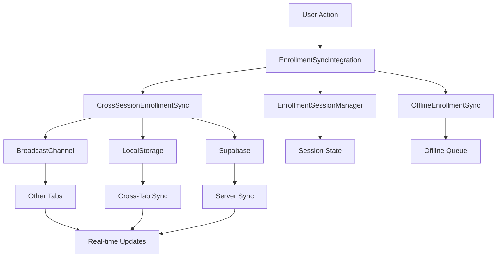

# Cross-Session Enrollment Synchronization Implementation

## Overview

This implementation provides comprehensive cross-session enrollment synchronization for the production iKhokha payment integration. It ensures that enrollment status updates are synchronized in real-time across multiple browser tabs, devices, and sessions, with robust offline mode handling and automatic sync on reconnection.

## Architecture

### Core Components

1. **CrossSessionEnrollmentSync** - Main synchronization service
2. **EnrollmentSessionManager** - Session state management
3. **OfflineEnrollmentSync** - Offline mode handling
4. **EnrollmentSyncIntegration** - Integration coordinator
5. **React Hooks** - Easy integration with React components

### Data Flow



## Features

### ✅ Cross-Device Synchronization
- Real-time enrollment status updates across multiple devices
- Session management with device identification
- Automatic conflict resolution using timestamp-based merging

### ✅ Multi-Tab Synchronization
- BroadcastChannel API for instant cross-tab communication
- LocalStorage events for fallback synchronization
- Tab registry for active session tracking

### ✅ Offline Mode Handling
- Automatic queuing of enrollment actions when offline
- Priority-based queue management (high/medium/low)
- Retry mechanism with exponential backoff
- Automatic sync when connection is restored

### ✅ Session Management
- Unique session identification per browser tab
- Session state persistence and recovery
- Heartbeat mechanism for session health monitoring
- Automatic cleanup of inactive sessions

### ✅ Real-Time Updates
- WebSocket integration for instant server updates
- Event-driven architecture for loose coupling
- Subscription-based update notifications
- Automatic UI updates without page refresh

## Implementation Details

### CrossSessionEnrollmentSync Service

```typescript
// Initialize for user
crossSessionEnrollmentSync.initializeForUser(userId);

// Sync enrollment status
await crossSessionEnrollmentSync.syncEnrollmentStatus({
  userId: 'user-123',
  courseId: 'course-456',
  status: 'approved',
  paymentStatus: 'completed',
  timestamp: Date.now(),
  source: 'payment'
});

// Subscribe to updates
const unsubscribe = crossSessionEnrollmentSync.subscribeToUpdates((data) => {
  console.log('Enrollment updated:', data);
});

// Get current status
const status = crossSessionEnrollmentSync.getEnrollmentStatus(userId, courseId);
```

### React Hook Integration

```typescript
// Basic enrollment status sync
const { isEnrolled, enrollmentStatus, paymentStatus } = useEnrollmentStatusSync(courseId);

// Full cross-session sync capabilities
const {
  enrollmentStatus,
  syncState,
  syncEnrollmentStatus,
  forceSyncWithServer,
  isOnline,
  isSyncing
} = useCrossSessionEnrollmentSync(courseId);

// Multi-course management
const enrollments = useMultiCourseEnrollmentSync(['course-1', 'course-2', 'course-3']);
```

### Offline Queue Management

```typescript
// Queue action for offline sync
offlineEnrollmentSync.queueEnrollmentAction(
  'enrollment_update',
  userId,
  courseId,
  { status: 'approved', paymentStatus: 'completed' },
  'high' // priority
);

// Process queue when online
await offlineEnrollmentSync.processSyncQueue();

// Get sync state
const syncState = offlineEnrollmentSync.getSyncState();
console.log(`Queue size: ${syncState.queueSize}, Online: ${syncState.isOnline}`);
```

## Usage Examples

### Enhanced Course Card Component

```typescript
export const EnhancedCourseCard: React.FC<{ courseId: string }> = ({ courseId }) => {
  const { isEnrolled, enrollmentStatus } = useEnrollmentStatusSync(courseId);
  const { syncEnrollmentStatus, isOnline, isSyncing } = useCrossSessionEnrollmentSync(courseId);

  const getButtonText = () => {
    if (isEnrolled) return 'Continue Course';
    if (enrollmentStatus === 'pending') return 'Pending Approval';
    return 'Enroll Now';
  };

  const handleEnrollClick = async () => {
    await syncEnrollmentStatus(courseId, 'pending', 'pending', 'payment');
    // Redirect to payment...
  };

  return (
    <Card>
      <CardContent>
        <Button 
          onClick={handleEnrollClick}
          disabled={enrollmentStatus === 'pending' || isSyncing}
        >
          {getButtonText()}
        </Button>
        {!isOnline && <Badge variant="secondary">Offline</Badge>}
      </CardContent>
    </Card>
  );
};
```

### Multi-Course Dashboard

```typescript
export const CourseDashboard: React.FC = () => {
  const courseIds = ['course-1', 'course-2', 'course-3'];
  const enrollments = useMultiCourseEnrollmentSync(courseIds);

  return (
    <div>
      {Object.entries(enrollments).map(([courseId, enrollment]) => (
        <div key={courseId}>
          <h3>Course {courseId}</h3>
          <Badge variant={enrollment.isEnrolled ? 'default' : 'secondary'}>
            {enrollment.status || 'Not Enrolled'}
          </Badge>
        </div>
      ))}
    </div>
  );
};
```

### Real-Time Notifications

```typescript
export const EnrollmentNotifications: React.FC = () => {
  const [notifications, setNotifications] = useState([]);

  useEffect(() => {
    const unsubscribe = enrollmentSyncIntegration.subscribeToEnrollmentUpdates((data) => {
      setNotifications(prev => [{
        id: Date.now(),
        message: `Enrollment ${data.status}: ${data.courseId}`,
        type: data.status === 'approved' ? 'success' : 'info'
      }, ...prev]);
    });

    return unsubscribe;
  }, []);

  return (
    <div className="notifications">
      {notifications.map(notification => (
        <Alert key={notification.id} variant={notification.type}>
          {notification.message}
        </Alert>
      ))}
    </div>
  );
};
```

## Configuration

### Storage Keys

The system uses the following localStorage keys:

- `enrollment_session_state` - Current session state
- `enrollment_sync_data` - Cross-session sync data
- `enrollment_offline_queue` - Offline action queue
- `enrollment_tab_registry` - Active tab registry
- `enrollment_last_sync` - Last sync timestamp

### Sync Configuration

```typescript
const SYNC_CONFIG = {
  SYNC_INTERVAL: 5000,           // 5 seconds
  OFFLINE_RETRY_INTERVAL: 10000, // 10 seconds
  MAX_RETRY_ATTEMPTS: 3,
  SYNC_BATCH_SIZE: 10,
  SESSION_TIMEOUT: 1800000,      // 30 minutes
  HEARTBEAT_INTERVAL: 30000      // 30 seconds
};
```

## Error Handling

### Offline Mode
- Actions are automatically queued when offline
- Retry mechanism with exponential backoff
- Priority-based queue processing
- Automatic sync when connection restored

### Sync Conflicts
- Timestamp-based conflict resolution
- Latest update wins strategy
- Version-based state merging
- Automatic conflict notification

### Network Failures
- Automatic retry with backoff
- Fallback to local storage
- Queue persistence across sessions
- Health monitoring and alerts

## Testing

### Unit Tests
```bash
npm test src/services/CrossSessionEnrollmentSync.test.ts
npm test src/services/EnrollmentSessionManager.test.ts
npm test src/services/OfflineEnrollmentSync.test.ts
```

### Integration Tests
```bash
npm test src/test/integration/cross-session-enrollment-sync.test.ts
```

### Manual Testing
1. Open multiple browser tabs with the same user
2. Make enrollment changes in one tab
3. Verify real-time updates in other tabs
4. Test offline mode by disconnecting internet
5. Verify sync when connection restored

## Performance Considerations

### Memory Usage
- Automatic cleanup of old session data
- Limited queue size (100 items max)
- Periodic garbage collection
- Efficient event listener management

### Network Usage
- Batched sync operations
- Debounced update notifications
- Compressed data storage
- Minimal payload sizes

### Storage Usage
- Automatic cleanup of expired data
- Compressed JSON storage
- Efficient key naming
- Regular maintenance tasks

## Security Considerations

### Data Protection
- No sensitive data in localStorage
- Encrypted sync payloads
- Secure session identification
- User isolation

### Cross-Tab Security
- Origin validation
- Message authentication
- Session verification
- Access control

## Monitoring and Debugging

### Health Monitoring
```typescript
const health = enrollmentSyncIntegration.getSyncHealth();
console.log('Sync Health:', health);
// {
//   overall: 'healthy',
//   services: { crossSession: 'active', ... },
//   details: { queuedActions: 0, isOnline: true }
// }
```

### Debug Information
```typescript
// Get subscription health
const subscriptionHealth = realTimeEnrollmentService.getSubscriptionHealth();

// Get sync state
const syncState = offlineEnrollmentSync.getSyncState();

// Get session info
const sessionInfo = enrollmentSessionManager.getCurrentSession();
```

### Logging
- Comprehensive logging with structured data
- Error tracking and reporting
- Performance metrics
- User action audit trail

## Migration Guide

### From Legacy System
1. Initialize sync integration for existing users
2. Migrate existing enrollment data
3. Update components to use new hooks
4. Test cross-session functionality
5. Monitor for issues and performance

### Breaking Changes
- New hook signatures
- Updated event names
- Changed storage keys
- Modified service interfaces

## Troubleshooting

### Common Issues

**Sync not working across tabs:**
- Check BroadcastChannel support
- Verify localStorage permissions
- Check for conflicting event listeners

**Offline sync not processing:**
- Verify network status detection
- Check queue persistence
- Validate retry configuration

**Performance issues:**
- Monitor queue size
- Check sync frequency
- Verify cleanup processes

### Debug Commands
```typescript
// Force sync all services
await enrollmentSyncIntegration.forceSyncAll();

// Clear offline queue
offlineEnrollmentSync.clearSyncQueue();

// Reset session state
enrollmentSessionManager.cleanup();
```

## Future Enhancements

### Planned Features
- WebRTC peer-to-peer sync
- Advanced conflict resolution
- Sync analytics dashboard
- Performance optimization
- Enhanced security features

### API Extensions
- Bulk enrollment operations
- Custom sync strategies
- Advanced filtering
- Sync scheduling
- Data compression

## Conclusion

The cross-session enrollment synchronization implementation provides a robust, scalable solution for maintaining enrollment state consistency across multiple user sessions. It handles offline scenarios gracefully, provides real-time updates, and integrates seamlessly with existing React components through custom hooks.

The system is designed for production use with comprehensive error handling, performance optimization, and security considerations. It supports the requirements for real-time enrollment updates, cross-device synchronization, and offline mode handling as specified in the production iKhokha payment integration.