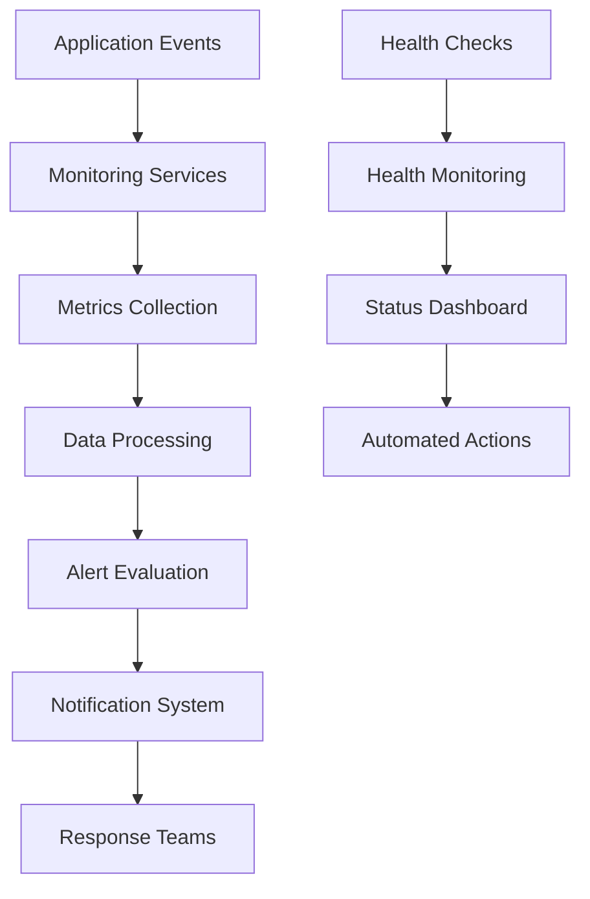

# Production Monitoring and Alerting Guide

## Overview

This guide provides comprehensive documentation for monitoring and alerting systems in the production Ikhokha payment integration. It covers monitoring setup, alert configuration, dashboard usage, and response procedures.

## Monitoring Architecture

### Core Monitoring Components

1. **ProductionMonitoringSetup**: Central monitoring configuration service
2. **ProductionHealthCheckSystem**: System health monitoring
3. **ProductionPerformanceMonitoringIntegration**: Performance metrics collection
4. **ProductionErrorHandling**: Error tracking and alerting
5. **ProductionSecurityValidator**: Security monitoring

### Monitoring Data Flow



## Monitoring Categories

### 1. Payment Monitoring

#### Payment Transaction Metrics
- **Transaction Success Rate**: Percentage of successful payments
- **Transaction Failure Rate**: Percentage of failed payments
- **Payment Processing Latency**: Time from initiation to completion
- **Payment Volume**: Number of transactions per time period
- **Revenue Tracking**: Total payment amounts processed

#### Key Performance Indicators (KPIs)
```typescript
interface PaymentKPIs {
  success_rate: number;           // Target: >95%
  average_latency: number;        // Target: <5 seconds
  failure_rate: number;           // Target: <5%
  daily_volume: number;           // Baseline tracking
  conversion_rate: number;        // Target: >80%
}
```

#### Payment Monitoring Setup
```bash
# Enable payment monitoring
npm run monitoring:enable-payment

# View payment metrics
npm run monitoring:payment-dashboard

# Generate payment reports
npm run monitoring:payment-report
```

### 2. System Health Monitoring

#### Health Check Endpoints
- `/api/health` - Overall system health
- `/api/health/payment` - Payment system health
- `/api/health/webhook` - Webhook processing health
- `/api/health/database` - Database connectivity
- `/api/health/api` - External API connectivity

#### Health Metrics
```typescript
interface SystemHealthMetrics {
  overall_health: 'healthy' | 'degraded' | 'unhealthy';
  api_connectivity: boolean;
  database_connectivity: boolean;
  webhook_processing: boolean;
  payment_system: boolean;
  response_time: number;
  uptime_percentage: number;
}
```

#### Health Monitoring Configuration
```bash
# Configure health checks
npm run health:configure

# Run health diagnostics
npm run health:diagnose

# Monitor health status
npm run health:monitor
```

### 3. Performance Monitoring

#### Performance Metrics
- **Response Time**: API endpoint response times
- **Throughput**: Requests per second
- **Resource Usage**: CPU, memory, disk usage
- **Database Performance**: Query execution times
- **Network Latency**: External API call latencies

#### Performance Thresholds
```typescript
interface PerformanceThresholds {
  api_response_time: {
    warning: 5000;    // 5 seconds
    critical: 10000;  // 10 seconds
  };
  memory_usage: {
    warning: 80;      // 80%
    critical: 95;     // 95%
  };
  cpu_usage: {
    warning: 70;      // 70%
    critical: 90;     // 90%
  };
  database_query_time: {
    warning: 1000;    // 1 second
    critical: 5000;   // 5 seconds
  };
}
```

### 4. Error Monitoring

#### Error Categories
- **Application Errors**: Code exceptions and runtime errors
- **Payment Errors**: Payment processing failures
- **Webhook Errors**: Webhook processing failures
- **Configuration Errors**: Environment and setup issues
- **Security Errors**: Security violations and threats

#### Error Tracking
```typescript
interface ErrorMetrics {
  error_rate: number;
  error_count: number;
  error_categories: {
    application: number;
    payment: number;
    webhook: number;
    configuration: number;
    security: number;
  };
  critical_errors: number;
  resolved_errors: number;
}
```

### 5. Security Monitoring

#### Security Events
- **Authentication Failures**: Failed login attempts
- **Authorization Violations**: Unauthorized access attempts
- **Webhook Security**: Invalid webhook signatures
- **API Security**: Suspicious API usage patterns
- **Data Access**: Unusual data access patterns

#### Security Metrics
```typescript
interface SecurityMetrics {
  authentication_failures: number;
  authorization_violations: number;
  webhook_security_violations: number;
  suspicious_activities: number;
  blocked_requests: number;
  security_incidents: number;
}
```

## Alert Configuration

### Alert Severity Levels

#### Critical (P0) - Immediate Response Required
- Payment processing completely down
- Security breaches detected
- System unavailable
- Data corruption detected

**Response Time**: Immediate (0-5 minutes)
**Notification Channels**: Phone, SMS, Email, Slack, Webhook

#### High (P1) - Urgent Response Required
- Payment failure rate >10%
- High error rates
- Performance degradation
- Security warnings

**Response Time**: 15 minutes
**Notification Channels**: Email, Slack, Webhook

#### Medium (P2) - Standard Response
- Payment failure rate 5-10%
- Minor performance issues
- Configuration warnings
- Non-critical errors

**Response Time**: 1 hour
**Notification Channels**: Email, Slack

#### Low (P3) - Informational
- Performance optimization opportunities
- Minor warnings
- Maintenance notifications

**Response Time**: Next business day
**Notification Channels**: Email

### Alert Rules Configuration

#### Payment Alerts
```yaml
payment_alerts:
  payment_processing_failure:
    condition: "payment_failure_rate > 5% for 5 minutes"
    severity: "critical"
    notification: ["phone", "email", "slack"]
    
  high_payment_latency:
    condition: "avg_payment_latency > 10 seconds for 3 minutes"
    severity: "high"
    notification: ["email", "slack"]
    
  payment_volume_drop:
    condition: "payment_volume < 50% of baseline for 15 minutes"
    severity: "medium"
    notification: ["email", "slack"]
```

#### System Health Alerts
```yaml
system_health_alerts:
  system_down:
    condition: "health_check_failures > 3 consecutive"
    severity: "critical"
    notification: ["phone", "email", "slack", "webhook"]
    
  database_connectivity:
    condition: "database_connection_failures > 2 in 5 minutes"
    severity: "high"
    notification: ["email", "slack"]
    
  api_connectivity:
    condition: "api_connection_failures > 5 in 10 minutes"
    severity: "high"
    notification: ["email", "slack"]
```

#### Performance Alerts
```yaml
performance_alerts:
  high_response_time:
    condition: "avg_response_time > 5 seconds for 5 minutes"
    severity: "medium"
    notification: ["email", "slack"]
    
  high_memory_usage:
    condition: "memory_usage > 90% for 10 minutes"
    severity: "high"
    notification: ["email", "slack"]
    
  high_cpu_usage:
    condition: "cpu_usage > 85% for 15 minutes"
    severity: "medium"
    notification: ["email", "slack"]
```

#### Security Alerts
```yaml
security_alerts:
  security_breach:
    condition: "security_violations > 0"
    severity: "critical"
    notification: ["phone", "email", "slack", "webhook"]
    
  suspicious_activity:
    condition: "failed_auth_attempts > 10 in 5 minutes"
    severity: "high"
    notification: ["email", "slack"]
    
  webhook_security_violation:
    condition: "invalid_webhook_signatures > 3 in 5 minutes"
    severity: "medium"
    notification: ["email", "slack"]
```

## Monitoring Dashboards

### Production Overview Dashboard

#### Key Metrics Display
- System health status
- Payment processing metrics
- Error rates and trends
- Performance indicators
- Security status

#### Dashboard Sections
1. **System Status**: Overall health indicators
2. **Payment Metrics**: Transaction success/failure rates
3. **Performance**: Response times and throughput
4. **Errors**: Error counts and trends
5. **Security**: Security events and violations

### Payment Processing Dashboard

#### Payment Metrics
- Real-time transaction status
- Payment success/failure rates
- Processing latency trends
- Revenue tracking
- Conversion funnel analysis

#### Enrollment Metrics
- Enrollment creation rates
- Approval processing times
- Course access granting
- User experience metrics

### System Health Dashboard

#### Infrastructure Metrics
- Server health status
- Database performance
- API connectivity
- Resource utilization
- Network performance

#### Application Metrics
- Application uptime
- Feature availability
- User session metrics
- Error rates by component

### Security Dashboard

#### Security Events
- Authentication events
- Authorization violations
- Webhook security events
- Threat detection alerts
- Incident response status

#### Compliance Metrics
- Security policy compliance
- Audit trail completeness
- Data protection metrics
- Access control effectiveness

## Monitoring Tools and Integration

### Monitoring Stack

#### Core Monitoring Tools
- **Metrics Collection**: Custom monitoring services
- **Log Aggregation**: Centralized logging system
- **Alerting**: Multi-channel notification system
- **Dashboards**: Real-time monitoring dashboards
- **Incident Management**: Automated incident creation

#### Integration Points
```typescript
interface MonitoringIntegration {
  metrics_endpoint: string;
  log_aggregation: string;
  alert_webhook: string;
  dashboard_url: string;
  incident_api: string;
}
```

### Monitoring Setup Commands

#### Initial Setup
```bash
# Initialize monitoring
npm run monitoring:init

# Configure monitoring services
npm run monitoring:configure

# Setup dashboards
npm run monitoring:setup-dashboards

# Configure alerts
npm run monitoring:setup-alerts
```

#### Daily Operations
```bash
# Check monitoring status
npm run monitoring:status

# View current metrics
npm run monitoring:metrics

# Generate reports
npm run monitoring:report

# Test alerting
npm run monitoring:test-alerts
```

## Response Procedures

### Alert Response Workflow

#### 1. Alert Reception
- Receive alert notification
- Acknowledge alert receipt
- Assess alert severity
- Determine response team

#### 2. Initial Assessment
- Review alert details
- Check monitoring dashboards
- Verify system status
- Identify affected components

#### 3. Investigation
- Gather diagnostic information
- Review system logs
- Check recent changes
- Identify root cause

#### 4. Resolution
- Implement fix or workaround
- Verify resolution
- Update monitoring status
- Document resolution steps

#### 5. Post-Incident
- Conduct post-mortem review
- Update documentation
- Implement preventive measures
- Update monitoring rules

### Escalation Matrix

#### On-Call Rotation
- **Primary**: First responder (5-minute response)
- **Secondary**: Backup responder (15-minute response)
- **Escalation**: Team lead (30-minute response)
- **Executive**: Management (1-hour response)

#### Escalation Triggers
- No response within SLA timeframes
- Issue cannot be resolved by current level
- Multiple systems affected
- Customer impact exceeds thresholds

### Communication Procedures

#### Internal Communication
- Update incident status in monitoring system
- Notify relevant team members
- Provide regular status updates
- Document resolution steps

#### External Communication
- Notify affected customers if needed
- Update status page
- Provide estimated resolution time
- Send resolution confirmation

## Monitoring Maintenance

### Regular Maintenance Tasks

#### Daily Tasks
- Review overnight alerts
- Check system health status
- Verify monitoring data collection
- Update alert acknowledgments

#### Weekly Tasks
- Review monitoring performance
- Update alert thresholds
- Analyze trending data
- Test backup monitoring systems

#### Monthly Tasks
- Review and update alert rules
- Analyze monitoring effectiveness
- Update monitoring documentation
- Conduct monitoring system health checks

### Monitoring System Health

#### Monitoring the Monitors
- Monitor monitoring system uptime
- Verify alert delivery
- Test notification channels
- Validate data collection accuracy

#### Performance Optimization
- Optimize monitoring queries
- Reduce monitoring overhead
- Improve dashboard performance
- Enhance alert accuracy

## Metrics and KPIs

### Business Metrics
- Payment conversion rate
- Revenue per transaction
- Customer satisfaction scores
- System availability percentage

### Technical Metrics
- Mean time to detection (MTTD)
- Mean time to resolution (MTTR)
- System uptime percentage
- Error rate trends

### Operational Metrics
- Alert accuracy rate
- False positive rate
- Response time compliance
- Incident resolution rate

## Documentation and Training

### Documentation Requirements
- Monitoring setup procedures
- Alert response playbooks
- Dashboard usage guides
- Troubleshooting procedures

### Training Programs
- New team member onboarding
- Alert response training
- Dashboard usage training
- Incident management training

### Knowledge Base
- Common issues and solutions
- Best practices documentation
- Lessons learned repository
- Contact information directory

---

**Last Updated**: [Current Date]
**Version**: 1.0
**Maintained By**: Production Operations Team